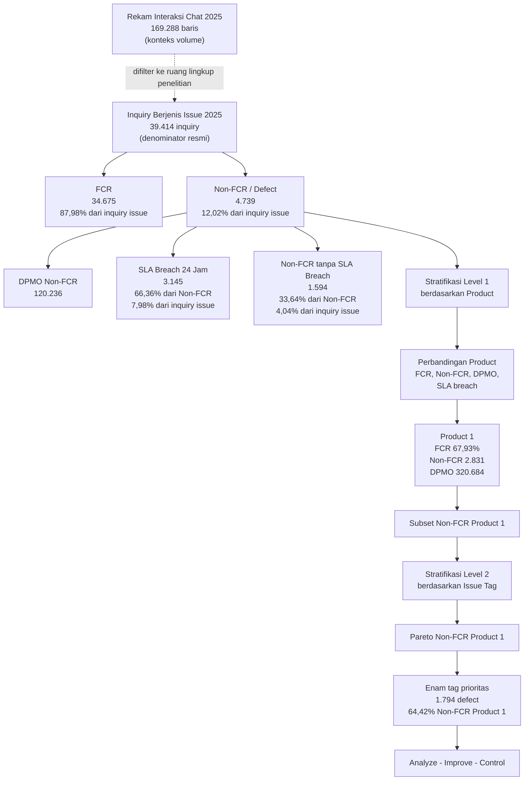

# Angka Baseline 2025 - FCR Non-FCR SLA

## Inti Satu Kalimat

Pada baseline 2025, denominator resmi penelitian adalah **39.414 inquiry berjenis issue** pada kanal live chat; dari jumlah tersebut **34.675 inquiry atau 87,98%** berstatus FCR, sedangkan **4.739 inquiry atau 12,02%** berstatus Non-FCR dan diperlakukan sebagai defect. Nilai DPMO Non-FCR agregat adalah **120.236**, sedangkan SLA breach 24 jam tercatat **3.145 inquiry atau 7,98%** dari total inquiry berjenis issue.

## Terminologi Resmi

| Istilah | Makna dalam penelitian |
|---|---|
| Customer Inquiries | Seluruh permintaan layanan pelanggan yang masuk ke sistem layanan pelanggan. |
| Inquiry berjenis issue | Subset Customer Inquiries yang berisi kendala/masalah produk dan menjadi ruang lingkup pengukuran FCR, Non-FCR, DPMO, dan SLA breach. |
| FCR | Inquiry berjenis issue yang selesai pada kontak pertama melalui kanal live chat. |
| Non-FCR | Inquiry berjenis issue yang tidak selesai pada kontak pertama; diperlakukan sebagai defect dalam penelitian. |
| DPMO Non-FCR | Ukuran kapabilitas proses yang dihitung dari Non-FCR terhadap total inquiry berjenis issue dengan satu opportunity per inquiry. |
| SLA breach 24 jam | Inquiry berjenis issue yang melewati batas waktu penyelesaian 24 jam; digunakan sebagai metrik dampak pendukung, bukan defect utama. |
| Product | Dimensi stratifikasi level pertama untuk memilih area prioritas pada fase Measure. |
| Issue tag | Dimensi stratifikasi level kedua di dalam Product 1 untuk membuat Pareto Non-FCR. |

## Catatan Denominator

Ada dua angka volume yang perlu dibedakan:

| Angka | Nilai | Fungsi |
|---|---:|---|
| Total rekam interaksi chat 2025 | 169.288 baris chat | Konteks volume interaksi, bukan denominator FCR/DPMO. |
| Total inquiry berjenis issue 2025 | 39.414 inquiry | Denominator resmi FCR, Non-FCR, DPMO, dan SLA breach. |

Jadi ketika membahas FCR, Non-FCR, DPMO, dan SLA breach, denominator yang dipakai adalah **39.414 inquiry berjenis issue**, bukan seluruh baris interaksi chat.

## Baseline Utama 2025

| Metrik | Jumlah | Persentase dari total inquiry berjenis issue | Fungsi dalam riset |
|---|---:|---:|---|
| Total inquiry berjenis issue | 39.414 | 100,00% | Populasi pengukuran utama. |
| FCR | 34.675 | 87,98% | CTQ atau indikator kualitas utama. |
| Non-FCR / defect | 4.739 | 12,02% | Defect utama untuk perhitungan DPMO. |
| DPMO Non-FCR | 120.236 | - | Ukuran kapabilitas proses baseline agregat. |
| SLA breach 24 jam | 3.145 | 7,98% | Metrik dampak pendukung terhadap standar 24 jam. |
| Non-FCR tanpa SLA breach | 1.594 | 4,04% | Non-FCR yang tidak melewati SLA 24 jam. |

## Pecahan Non-FCR

| Pecahan Non-FCR | Jumlah | Persentase dari Non-FCR | Persentase dari total inquiry berjenis issue |
|---|---:|---:|---:|
| Non-FCR dengan SLA breach | 3.145 | 66,36% | 7,98% |
| Non-FCR tanpa SLA breach | 1.594 | 33,64% | 4,04% |
| Total Non-FCR | 4.739 | 100,00% | 12,02% |

Catatan: persentase SLA breach resmi dalam draft dihitung terhadap total inquiry berjenis issue. Persentase SLA breach terhadap Non-FCR dipakai hanya untuk membaca seberapa besar defect yang berlanjut menjadi pelanggaran SLA 24 jam.

## Data Lineage Angka



## Product-Level Baseline

| Produk | Total inquiry berjenis issue | FCR | FCR rate | Non-FCR | Non-FCR rate | DPMO Non-FCR | SLA breach | SLA breach rate | SLA breach dari Non-FCR |
|---|---:|---:|---:|---:|---:|---:|---:|---:|---:|
| Product 1 | 8.828 | 5.997 | 67,93% | 2.831 | 32,07% | 320.684 | 1.784 | 20,21% | 63,02% |
| Product 2 | 30.586 | 28.678 | 93,76% | 1.908 | 6,24% | 62.381 | 1.361 | 4,45% | 71,33% |
| Total | 39.414 | 34.675 | 87,98% | 4.739 | 12,02% | 120.236 | 3.145 | 7,98% | 66,36% |

Cara membaca tabel:

- Product 1 menjadi area prioritas karena FCR jauh lebih rendah, Non-FCR rate jauh lebih tinggi, DPMO lebih besar, dan SLA breach rate lebih tinggi dibanding Product 2.
- Product 2 memiliki proporsi SLA breach dari Non-FCR yang lebih tinggi, tetapi secara keseluruhan Product 1 tetap lebih bermasalah karena jumlah dan rate Non-FCR serta SLA breach terhadap total inquiry lebih besar.
- SLA breach rate utama tetap dihitung terhadap total inquiry berjenis issue pada produk yang sama.

## Pareto Product 1 Baseline

| Rank | Issue tag | Non-FCR 2025 | Kontribusi kumulatif |
|---:|---|---:|---:|
| 1 | REPORT ERP | 380 | 13,64% |
| 2 | PURCHASING | 380 | 27,29% |
| 3 | INVENTORY | 377 | 40,83% |
| 4 | ACCOUNTING | 269 | 50,48% |
| 5 | FINANCE | 195 | 57,49% |
| 6 | MASTER | 193 | 64,42% |
|  | Total enam tag utama | 1.794 | 64,42% |

Enam tag ini berasal dari Pareto Non-FCR Product 1 dan menjadi fokus Analyze dan Improve. Jumlah enam tag bukan asumsi awal, tetapi hasil pembacaan Pareto dan kelayakan pendalaman analisis pada periode penelitian.

## Cara Membaca untuk Riset

1. FCR adalah CTQ utama.
2. Non-FCR adalah defect utama karena inquiry tidak selesai pada kontak pertama.
3. DPMO dihitung dari Non-FCR terhadap total inquiry berjenis issue.
4. SLA breach adalah metrik dampak pendukung, bukan defect utama.
5. Product dipakai sebagai stratifikasi level pertama untuk menemukan area prioritas.
6. Product 1 ditetapkan sebagai area prioritas karena FCR, Non-FCR, DPMO, dan SLA breach menunjukkan masalah paling besar.
7. Setelah Product 1 dipilih, issue tag dipakai sebagai stratifikasi level kedua untuk membuat Pareto Non-FCR Product 1.
8. DMAIC diterapkan pada area prioritas yang muncul dari stratifikasi bertingkat, bukan dari asumsi awal peneliti.

## Formula Terkait

```text
FCR rate = FCR inquiry / total inquiry berjenis issue x 100%
```

```text
Non-FCR rate = Non-FCR inquiry / total inquiry berjenis issue x 100%
```

```text
DPMO = Non-FCR inquiry / (total inquiry berjenis issue x 1 opportunity) x 1.000.000
```

```text
SLA breach rate = SLA breach inquiry / total inquiry berjenis issue x 100%
```

```text
SLA breach within Non-FCR = SLA breach inquiry / Non-FCR inquiry x 100%
```

## Narasi Siap Pakai

Pada baseline 2025, terdapat 39.414 inquiry berjenis issue yang menjadi populasi pengukuran utama penelitian. Dari jumlah tersebut, 34.675 inquiry atau 87,98% berhasil diselesaikan pada kontak pertama dan dikategorikan sebagai FCR. Sementara itu, 4.739 inquiry atau 12,02% tidak berhasil diselesaikan pada kontak pertama dan dikategorikan sebagai Non-FCR atau defect proses. Dengan asumsi satu inquiry sebagai satu unit dan satu opportunity, DPMO Non-FCR baseline agregat adalah 120.236. Dari 4.739 inquiry Non-FCR tersebut, 3.145 inquiry atau 66,36% mengalami SLA breach 24 jam, sedangkan 1.594 inquiry atau 33,64% tidak mengalami SLA breach. Defect kemudian distratifikasi pada level produk untuk menemukan area prioritas. Product 1 ditetapkan sebagai area prioritas karena memiliki FCR 67,93%, Non-FCR 2.831 inquiry, DPMO 320.684, dan SLA breach rate 20,21%. Setelah Product 1 ditetapkan, Non-FCR Product 1 distratifikasi kembali berdasarkan issue tag untuk menentukan kontributor utama melalui Pareto.

## Koneksi

- [[Relasi Metrik BAB 1-3]]
- [[BAB 1 - Summary Pendahuluan]]
- [[BAB 3 - Summary Metodologi Penelitian]]
- [[BAB 4 - Summary Hasil Penelitian]]
- [[BAB 5 - Summary Simpulan dan Saran]]
