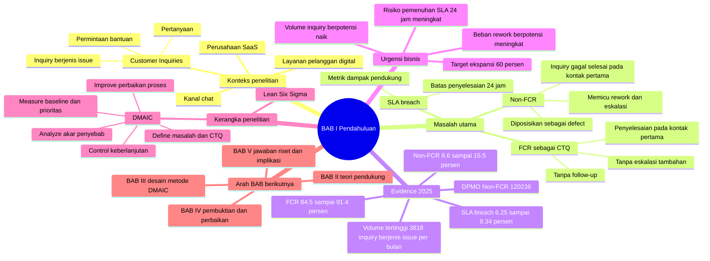

# BAB 1 - Summary Pendahuluan

## Inti Satu Kalimat

BAB I membangun argumen bahwa fluktuasi First Call Resolution (FCR) pada proses layanan pelanggan SaaS bukan sekadar masalah operasional harian, tetapi masalah kualitas proses yang perlu dianalisis dengan Lean Six Sigma DMAIC karena Non-FCR menimbulkan rework, eskalasi, SLA breach, dan risiko skalabilitas saat volume inquiry meningkat.

## Memory Hook

Digital service -> SaaS inquiries -> FCR sebagai CTQ -> Non-FCR sebagai defect -> SLA breach dan DPMO -> risiko ekspansi 60% -> perlu DMAIC.

## Mindmap BAB I

## Storyline BAB I

BAB I dimulai dari perubahan ekspektasi layanan pelanggan di era digital. Perusahaan tidak cukup hanya cepat merespons pelanggan, tetapi harus mampu menyelesaikan masalah pelanggan secara tuntas pada kontak pertama.

Konteks kemudian dipersempit ke perusahaan Software as a Service (SaaS), di mana pelanggan berinteraksi dengan produk dan layanan secara berkelanjutan. Dalam konteks ini, Customer Inquiries menjadi representasi empiris dari customer service demand.

Penelitian lalu menetapkan FCR sebagai indikator utama efektivitas proses. FCR dipakai karena mengukur kemampuan Customer Service menyelesaikan inquiry pelanggan berjenis issue pada interaksi chat pertama tanpa follow-up atau eskalasi tambahan.

Masalah empiris muncul dari data 2025. FCR bulanan berada pada rentang 84,5% hingga 91,4%, sehingga masih ada Non-FCR sebesar 8,6% hingga 15,5% setiap bulan. Artinya, sebagian inquiry masih gagal diselesaikan pada kontak pertama.

Non-FCR kemudian diterjemahkan sebagai masalah proses. Ketika inquiry tidak selesai pada kontak pertama, Customer Service perlu melakukan eskalasi dan interaksi lanjutan. Ini memicu rework, memperpanjang proses penyelesaian, dan berkontribusi pada SLA breach 24 jam.

BAB I memperkuat urgensi dengan metrik Lean Six Sigma. Non-FCR diperlakukan sebagai defect, setiap inquiry diperlakukan sebagai satu unit dengan satu opportunity, dan baseline DPMO Non-FCR tahun 2025 mencapai 120.236. Angka ini menunjukkan bahwa kegagalan proses cukup besar jika dibaca dalam ukuran kapabilitas proses.

Urgensi strategis muncul karena perusahaan memiliki target ekspansi bisnis 60% dari baseline 2025. Jika proses layanan masih menghasilkan Non-FCR dan SLA breach pada volume saat ini, maka peningkatan volume inquiry berisiko memperbesar beban rework dan kegagalan pemenuhan SLA.

BAB I ditutup dengan pemilihan Lean Six Sigma DMAIC sebagai pendekatan penelitian. DMAIC dipilih karena menyediakan alur sistematis untuk mendefinisikan masalah, mengukur baseline, menganalisis akar penyebab, memperbaiki proses, dan mengendalikan hasil perbaikan.

## Angka Kunci

| Metrik | Nilai | Makna |
|---|---:|---|
| FCR 2025 | 84,5% - 91,4% | Kinerja penyelesaian kontak pertama masih fluktuatif. |
| Non-FCR 2025 | 8,6% - 15,5% | Masih ada inquiry yang gagal selesai pada kontak pertama setiap bulan. |
| SLA breach 2025 | 6,25% - 9,34% | Proses belum konsisten menjaga penyelesaian dalam SLA 24 jam. |
| Baseline DPMO Non-FCR | 120.236 | Non-FCR dibaca sebagai defect dalam kapabilitas proses. |
| Volume historis tertinggi | 3.818 inquiry berjenis issue/bulan | Beban layanan dapat memperbesar dampak kegagalan proses. |
| Target ekspansi bisnis | 60% | Risiko proses meningkat jika FCR tidak distabilkan. |

## Alur Argumen

| Lokasi | Ide Utama | Fungsi dalam BAB I |
|---|---|---|
| Latar Belakang P1 | Layanan pelanggan harus menyelesaikan masalah, bukan hanya merespons cepat. | Membuka urgensi umum. |
| Latar Belakang P2 | SaaS meningkatkan intensitas Customer Inquiries. | Menetapkan konteks industri. |
| Latar Belakang P3 | FCR dipilih sebagai indikator efektivitas layanan. | Mengunci CTQ penelitian. |
| Latar Belakang P4 | Data dibatasi pada inquiry berjenis issue melalui kanal chat. | Mengunci objek empiris. |
| Gambar 1.1 dan P5 | FCR 2025 fluktuatif, Non-FCR masih muncul setiap bulan. | Menunjukkan gap kinerja. |
| Latar Belakang P6 | Non-FCR memicu rework, eskalasi, dan SLA breach. | Menjelaskan dampak operasional. |
| Latar Belakang P7 | Non-FCR diperlakukan sebagai defect dan diukur dengan DPMO. | Mengubah masalah layanan menjadi masalah kualitas proses. |
| Latar Belakang P8 | Ekspansi 60% meningkatkan risiko jika proses tidak stabil. | Menambahkan urgensi bisnis. |
| Latar Belakang P9 | Lean Six Sigma DMAIC dipilih sebagai metode. | Menjembatani BAB I ke BAB II dan BAB III. |

## Rumusan Masalah dan Tujuan

| RQ | Fokus Pertanyaan | Tujuan yang Selaras |
|---|---|---|
| RQ1 | Pola dan distribusi variasi FCR berdasarkan karakteristik inquiry. | Mengidentifikasi pola dan distribusi variasi FCR. |
| RQ2 | Faktor proses yang berkontribusi terhadap variasi FCR. | Menganalisis faktor proses penyebab variasi FCR. |
| RQ3 | Penerapan Lean Six Sigma DMAIC untuk meningkatkan dan menstabilkan FCR. | Mengevaluasi penerapan DMAIC pada proses layanan pelanggan. |
| RQ4 | Usulan perbaikan berkelanjutan untuk mendukung SLA 24 jam. | Merumuskan perbaikan proses yang berkelanjutan. |

## Ruang Lingkup

- Objek penelitian adalah proses layanan pelanggan pada perusahaan SaaS.
- Kanal yang dianalisis adalah chat.
- Data utama difokuskan pada inquiry berjenis issue melalui kanal chat, bukan seluruh jenis Customer Inquiries.
- FCR menjadi indikator utama efektivitas penyelesaian pada kontak pertama.
- Non-FCR diperlakukan sebagai defect proses.
- Analisis variasi dilakukan berdasarkan karakteristik inquiry, seperti produk dan tipe issue.
- Waste dibaca terutama melalui variasi FCR, Non-FCR, rework, eskalasi, dan ketidakkonsistenan penyelesaian.

## Koneksi ke BAB Berikutnya

- BAB II harus menjelaskan teori yang dibutuhkan BAB I: SaaS, Customer Service, FCR, Lean Service, waste, DPMO, Lean Six Sigma, dan DMAIC.
- BAB III harus menerjemahkan masalah BAB I menjadi desain metode DMAIC.
- BAB IV harus membuktikan masalah BAB I dengan baseline, Pareto prioritas, root cause, Improve, dan Control.
- BAB V harus menjawab kembali RQ1-RQ4 dan menunjukkan implikasi praktis dari perbaikan proses.

## Catatan Koherensi

- BAB I sebaiknya tidak menyebut Product 1 terlalu awal, karena Product 1 baru muncul sebagai hasil fase Measure di BAB IV.
- Ruang lingkup BAB I di draft masih menyebut data 2026 sebagai "data setelah perbaikan" secara umum. Jika mengikuti framing terbaru, ingatkan diri untuk membacanya sebagai: 2025 = baseline, Jan-Apr 2026 = implementasi PDCA, Jan-May 2026 = evaluasi awal.
- Klaim tentang SLA breach harus tetap hati-hati: SLA breach adalah metrik dampak pendukung, bukan bukti langsung kepuasan pelanggan.
- Waste di BAB I perlu tetap fokus pada defect/Non-FCR, rework, eskalasi, waiting, dan extra-processing agar tidak melebar dari analisis BAB IV.

## Ringkasan Super Singkat

BAB I bercerita bahwa proses layanan pelanggan SaaS perlu stabil karena pelanggan membutuhkan penyelesaian inquiry secara tuntas pada kontak pertama. FCR dipakai sebagai CTQ, sedangkan Non-FCR diperlakukan sebagai defect. Data 2025 menunjukkan FCR masih fluktuatif, Non-FCR masih signifikan, SLA breach masih terjadi, dan DPMO Non-FCR mencapai 120.236. Dengan target ekspansi 60%, risiko operasional akan meningkat jika proses tidak diperbaiki. Karena itu, penelitian menggunakan Lean Six Sigma DMAIC untuk mengukur, menganalisis, memperbaiki, dan mengendalikan proses layanan pelanggan.
