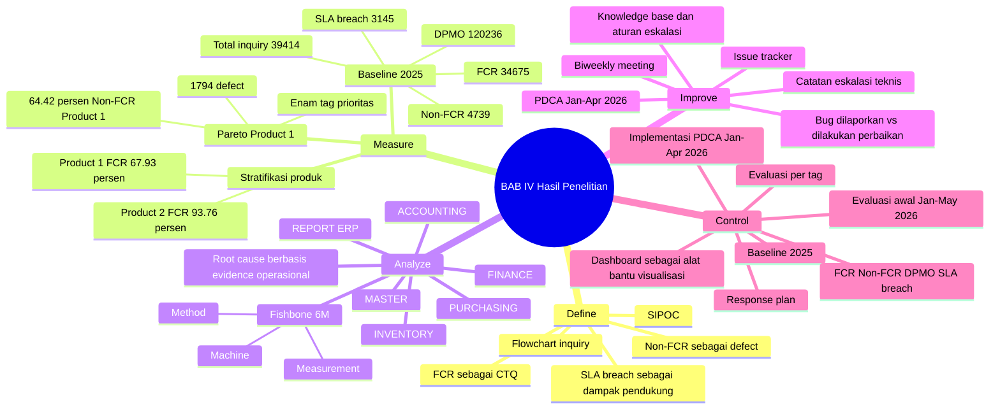

# BAB 4 - Summary Hasil Penelitian

## Inti Satu Kalimat

BAB IV menunjukkan pelaksanaan DMAIC pada proses Customer Inquiries kanal chat: baseline 2025 menunjukkan Non-FCR sebagai defect utama, Measure menetapkan Product 1 dan enam tag prioritas berbasis data, Analyze menemukan akar penyebab dominan pada Machine, Method, dan Measurement, Improve menjalankan PDCA Jan-Apr 2026, lalu Control membaca indikasi perbaikan melalui FCR, Non-FCR, DPMO, SLA breach, dan pergerakan tag prioritas.

## Memory Hook

Baseline 2025 -> Product 1 paling bermasalah -> enam tag Pareto -> Fishbone 6M -> PDCA Jan-Apr 2026 -> evaluasi awal Jan-May 2026 -> Control berbasis metrik dan response plan.

## Mindmap BAB IV

## Storyline BAB IV

BAB IV dimulai dengan fase Define. Pada bagian ini, penelitian menetapkan FCR sebagai Critical to Quality (CTQ), karena FCR menunjukkan kemampuan Customer Service menyelesaikan inquiry berjenis issue pada kontak pertama. Non-FCR diperlakukan sebagai defect karena menunjukkan kegagalan penyelesaian pada kontak pertama, sedangkan SLA breach dipakai sebagai metrik dampak pendukung.

Define kemudian memetakan proses layanan pelanggan menggunakan SIPOC dan flowchart. Tujuannya bukan mencari akar penyebab, tetapi memperjelas batas proses: inquiry diterima oleh Customer Service, diputuskan apakah selesai pada kontak pertama, atau perlu tindak lanjut sebagai Non-FCR. Dari sini penelitian bergerak ke Measure.

Fase Measure menghitung baseline 2025 untuk inquiry berjenis issue pada kanal live chat. Total inquiry 2025 adalah 39.414, dengan 34.675 FCR dan 4.739 Non-FCR. Dengan asumsi satu inquiry sebagai satu unit dan satu peluang defect, DPMO Non-FCR baseline perusahaan adalah 120.236.

Setelah baseline agregat dihitung, Measure melakukan stratifikasi berdasarkan produk. Product 1 memiliki total 8.828 inquiry, FCR 5.997, Non-FCR 2.831, FCR rate 67,93%, dan SLA breach rate 20,21%. Product 2 memiliki FCR rate 93,76% dan SLA breach rate 4,45%. Karena Product 1 memiliki FCR jauh lebih rendah dan kontribusi Non-FCR lebih besar, Product 1 ditetapkan sebagai area prioritas.

Pada Product 1, Pareto digunakan untuk menentukan fokus analisis. Enam tag terbesar adalah REPORT ERP, PURCHASING, INVENTORY, ACCOUNTING, FINANCE, dan MASTER. Keenam tag ini menghasilkan 1.794 defect atau 64,42% dari Non-FCR Product 1, sehingga menjadi fokus Analyze dan Improve.

Fase Analyze menelusuri akar penyebab Non-FCR pada enam tag prioritas tersebut. Data pendukung yang digunakan meliputi catatan inquiry, tagging penutupan issue, issue tracker, catatan eskalasi teknis, dan data tindak lanjut tim pengembang. Fishbone Diagram 6M dipakai untuk membaca penyebab secara proses, bukan hanya teknis.

Hasil Analyze menunjukkan bahwa akar penyebab dominan berada pada Machine, Method, dan Measurement. Machine terlihat dari logic sistem, query report, upload queue, settlement, pembentukan journal, dan perhitungan stock. Method terlihat dari kebutuhan manual query, manual repair, pengecekan langsung, dan eskalasi teknis berulang. Measurement terlihat dari ketidaksesuaian data antara report, journal, stock card, stock list, settlement, dan transaksi sumber.

Fase Improve menjalankan PDCA pada periode Januari-April 2026. Plan dilakukan dengan menyusun prioritas issue berdasarkan enam tag utama. Do dilakukan melalui biweekly meeting antara Customer Service dan tim pengembang. Check dilakukan dengan memantau status tindak lanjut pada issue tracker. Act dilakukan dengan memperbarui knowledge base, panduan penanganan issue, dan aturan eskalasi.

Evidence Improve menunjukkan jumlah bug yang dilaporkan dan sudah dilakukan perbaikan per tag. MASTER memiliki rasio perbaikan tertinggi, yaitu 21 dari 24 bug atau 88%. FINANCE 27 dari 35 bug atau 77%. INVENTORY 44 dari 56 bug atau 79%. PURCHASING 49 dari 66 bug atau 74%. REPORT ERP 47 dari 72 bug atau 65%. ACCOUNTING masih perlu kontrol lebih lanjut karena 31 dari 55 bug atau 56% sudah dilakukan perbaikan.

Fase Control membaca apakah perubahan kinerja pada evaluasi awal 2026 selaras dengan area yang dianalisis dan ditindaklanjuti. Control tidak mengklaim kausalitas mutlak, tetapi membaca indikasi perbaikan berdasarkan metrik FCR, Non-FCR, DPMO, SLA breach, dan pergerakan tag prioritas.

Pada Tabel 4.2, Product 1 membaik dari baseline 2025 ke evaluasi awal Januari-Mei 2026. FCR naik dari 67,93% menjadi 73,74%. Non-FCR rate turun dari 32,07% menjadi 26,26%. DPMO turun dari 320.684 menjadi 262.586. SLA breach rate turun dari 20,21% menjadi 14,56%. Perubahan ini terjadi meskipun rata-rata inquiry bulanan naik dari 735,67 menjadi 810,40.

Control kemudian mengecek tren bulanan 2025 sampai Mei 2026. Nilai FCR Maret-Mei 2026 berada di atas sebagian besar bulan baseline 2025, DPMO Mei 2026 turun sampai 207.483, dan SLA breach Mei 2026 turun ke 11,56%. Namun, karena FCR Product 1 sudah mulai naik pada November-Desember 2025, pembacaan agregat harus dilengkapi dengan evaluasi per tag.

Evaluasi per tag menunjukkan bahwa FINANCE dan MASTER memiliki perubahan paling kuat. FINANCE naik +8,13 pp dari FCR 53,35% menjadi 61,48%, sedangkan MASTER naik +10,06 pp dari FCR 75,78% menjadi 85,84%. REPORT ERP, PURCHASING, dan INVENTORY membaik moderat atau terbatas. ACCOUNTING turun -4,07 pp dan perlu kontrol lanjutan.

BAB IV ditutup dengan Control Plan. Mekanisme kontrol difokuskan pada pemantauan FCR, Non-FCR, DPMO, SLA breach, dan enam tag utama Product 1. Dashboard diposisikan sebagai alat bantu visualisasi, bukan inti Control. Inti Control adalah evaluasi metrik, response plan saat terjadi deviasi, issue tracker, standardisasi knowledge base, dan aturan eskalasi.

## Angka Kunci

| Area | Metrik | Nilai | Makna |
|---|---:|---:|---|
| Baseline perusahaan 2025 | Total inquiry | 39.414 | Total inquiry berjenis issue kanal chat. |
| Baseline perusahaan 2025 | FCR | 34.675 atau 87,98% | Inquiry selesai pada kontak pertama. |
| Baseline perusahaan 2025 | Non-FCR | 4.739 atau 12,02% | Defect utama penelitian. |
| Baseline perusahaan 2025 | DPMO Non-FCR | 120.236 | Kapabilitas baseline proses agregat. |
| Baseline perusahaan 2025 | SLA breach | 3.145 atau 7,98% | Dampak pendukung pada penyelesaian 24 jam. |
| Product 1 baseline 2025 | Total inquiry | 8.828 | Area prioritas hasil stratifikasi. |
| Product 1 baseline 2025 | FCR | 5.997 atau 67,93% | Lebih rendah dibanding Product 2. |
| Product 1 baseline 2025 | Non-FCR | 2.831 atau 32,07% | Kontributor defect terbesar. |
| Product 1 baseline 2025 | SLA breach | 1.784 atau 20,21% | Dampak pendukung paling tinggi. |
| Product 2 baseline 2025 | FCR rate | 93,76% | Pembanding yang jauh lebih baik. |
| Pareto Product 1 | Enam tag utama | 1.794 defect atau 64,42% | Fokus Analyze dan Improve. |

## Enam Tag Prioritas

| Rank | Tag issue | Non-FCR 2025 | Kumulatif | Domain issue |
|---:|---|---:|---:|---|
| 1 | REPORT ERP | 380 | 13,64% | Report/query transaksi. |
| 2 | PURCHASING | 380 | 27,29% | Validasi purchasing. |
| 3 | INVENTORY | 377 | 40,83% | Mutasi dan pencatatan stock. |
| 4 | ACCOUNTING | 269 | 50,48% | Journal dan validasi accounting. |
| 5 | FINANCE | 195 | 57,49% | Settlement, payment, payable. |
| 6 | MASTER | 193 | 64,42% | Master data dan upload/download queue. |

## Root Cause Utama

| Tag | Pola issue dominan | Pola akar penyebab | Dimensi Fishbone |
|---|---|---|---|
| REPORT ERP | Report GL, journal, PNL, BS, TB, report inventory. | Mismatch report dan transaksi sumber; logic query/kalkulasi belum konsisten. | Machine, Measurement |
| PURCHASING | Purchase invoice, purchase order, purchase payment. | Validasi transaksi dan integrasi purchasing belum menahan error sejak awal. | Machine, Method |
| INVENTORY | Goods receipt, item journal, goods delivery. | Mutasi stock dan sinkronisasi data memicu selisih stock. | Machine, Measurement |
| ACCOUNTING | Journal POS sales, general journal, GL/journal. | Pembentukan dan validasi journal membutuhkan pengecekan teknis lanjutan. | Machine, Measurement |
| FINANCE | POS settlement, cash payment, supplier payable. | Settlement/payment membutuhkan perbaikan logic atau data repair. | Machine, Method |
| MASTER | Master BOM, master product, upload/download queue. | Master data dan queue upload/download menimbulkan eskalasi berulang. | Machine, Method |

## Evidence Improve

| Tag issue | Bug dilaporkan | Bug dilakukan perbaikan | Persentase | Fokus tindak lanjut PDCA |
|---|---:|---:|---:|---|
| REPORT ERP | 72 | 47 | 65% | Perbaikan query, logic report, dan validasi data. |
| PURCHASING | 66 | 49 | 74% | Perbaikan rule, data, dan integrasi proses. |
| INVENTORY | 56 | 44 | 79% | Sinkronisasi stock dan validasi mutasi. |
| ACCOUNTING | 55 | 31 | 56% | Backlog journal/accounting perlu prioritas lanjutan. |
| FINANCE | 35 | 27 | 77% | Perbaikan logic transaksi dan data repair. |
| MASTER | 24 | 21 | 88% | Perbaikan data dan queue process. |

## Control Reading

| Periode | FCR | Non-FCR | DPMO | SLA breach | Rata-rata inquiry/bulan |
|---|---:|---:|---:|---:|---:|
| Baseline 2025 | 67,93% | 2.831 (32,07%) | 320.684 | 20,21% | 735,67 |
| Implementasi PDCA Jan-Apr 2026 | 72,21% | 881 (27,79%) | 277.918 | 15,39% | 792,50 |
| Evaluasi awal Jan-May 2026 | 73,74% | 1.064 (26,26%) | 262.586 | 14,56% | 810,40 |

Cara membacanya:

- FCR meningkat pada evaluasi awal 2026.
- Non-FCR rate menurun, sehingga defect rate membaik.
- DPMO menurun, sehingga kapabilitas proses Product 1 membaik.
- SLA breach rate menurun, sehingga dampak operasional ikut membaik.
- Rata-rata inquiry bulanan meningkat, sehingga perbaikan tidak terjadi pada volume yang lebih rendah.
- Klaim tetap hati-hati karena pembacaan agregat perlu dikonfirmasi dengan evaluasi per tag.

## Evaluasi Per Tag

| Tag issue | Bug dilakukan perbaikan | FCR 2025 | FCR Jan-May 2026 | Delta | Interpretasi |
|---|---:|---:|---:|---:|---|
| REPORT ERP | 47/72 | 54,60% | 59,21% | +4,61 pp | Membaik moderat. |
| PURCHASING | 49/66 | 76,47% | 79,03% | +2,56 pp | Membaik moderat. |
| INVENTORY | 44/56 | 73,36% | 75,05% | +1,69 pp | Membaik terbatas. |
| ACCOUNTING | 31/55 | 64,61% | 60,53% | -4,07 pp | Menurun, perlu kontrol. |
| FINANCE | 27/35 | 53,35% | 61,48% | +8,13 pp | Membaik kuat. |
| MASTER | 21/24 | 75,78% | 85,84% | +10,06 pp | Membaik paling kuat. |

Interpretasi utama: FINANCE dan MASTER menjadi evidence perubahan paling kuat karena keduanya memiliki proporsi perbaikan yang tinggi dan delta FCR terbesar. REPORT ERP, PURCHASING, dan INVENTORY tetap bergerak positif tetapi moderat. ACCOUNTING menjadi area kontrol karena FCR turun dibanding baseline 2025.

## Mapping RQ ke Jawaban BAB IV

| RQ | Dijawab di Fase | Jawaban BAB IV |
|---|---|---|
| RQ1: Pola dan distribusi variasi FCR berdasarkan karakteristik inquiry. | Measure | Variasi FCR terlihat pada stratifikasi produk. Product 1 memiliki FCR 67,93% dan menjadi area prioritas. Pareto Product 1 menunjukkan enam tag utama menyumbang 64,42% Non-FCR Product 1. |
| RQ2: Faktor proses yang berkontribusi terhadap variasi FCR. | Analyze | Akar penyebab dominan berada pada Machine, Method, dan Measurement: logic sistem, validasi transaksi, mismatch data, manual query, manual repair, dan eskalasi teknis berulang. |
| RQ3: Penerapan DMAIC untuk meningkatkan dan menstabilkan FCR. | Improve dan Control | PDCA Jan-Apr 2026 dijalankan melalui prioritas issue, biweekly meeting, issue tracker, dan tindak lanjut teknis. Evaluasi awal Jan-May 2026 menunjukkan FCR Product 1 naik dan Non-FCR/DPMO/SLA breach turun. |
| RQ4: Usulan perbaikan berkelanjutan untuk mendukung SLA 24 jam. | Control | Control Plan memantau FCR, Non-FCR, DPMO, SLA breach, dan enam tag utama Product 1. Tindak lanjut dilakukan melalui response plan, issue tracker, standardisasi knowledge base, dan aturan eskalasi. |

## Alur DMAIC BAB IV

| Fase | Fungsi | Output Utama |
|---|---|---|
| Define | Menetapkan masalah, CTQ, defect, dan alur proses. | FCR sebagai CTQ, Non-FCR sebagai defect, SLA breach sebagai dampak, SIPOC, flowchart inquiry. |
| Measure | Mengukur baseline dan menentukan prioritas. | Baseline 2025, Product 1 sebagai area prioritas, Pareto enam tag utama. |
| Analyze | Menemukan akar penyebab berbasis evidence. | Fishbone 6M, root cause dominan pada Machine, Method, Measurement. |
| Improve | Menjalankan tindak lanjut berbasis PDCA. | PDCA Jan-Apr 2026, biweekly meeting, issue tracker, bug dilaporkan vs dilakukan perbaikan. |
| Control | Membaca evaluasi awal dan menyiapkan pengendalian. | Evaluasi FCR/Non-FCR/DPMO/SLA breach, evaluasi per tag, Control Plan, response plan. |

## Catatan Koherensi

- Product 1 tidak muncul sebagai asumsi awal, tetapi sebagai hasil stratifikasi Measure.
- Enam tag prioritas tidak ditentukan di awal, tetapi berasal dari Pareto Product 1.
- Bug dan catatan teknis baru muncul setelah Analyze/Improve, bukan di Define atau Measure.
- Jan-Apr 2026 adalah periode implementasi PDCA, bukan after improvement murni.
- Jan-May 2026 adalah evaluasi awal atau control reading awal.
- Control tidak memakai p-value; interpretasi per tag bersifat deskriptif berdasarkan delta FCR dan evidence Improve.
- Dashboard hanya alat bantu visualisasi. Inti Control tetap evaluasi metrik, response plan, issue tracker, standardisasi, dan aturan eskalasi.
- Bahasa kausal harus hati-hati: gunakan "indikasi perbaikan", "membaik", atau "perubahan paling kuat", bukan klaim bahwa PDCA pasti menjadi satu-satunya penyebab perubahan.

## Backlog BAB IV

Semua backlog B4-01 sampai B4-10 sudah ditandai `Solved` di [[BAB 4 - Tracker Backlog Perbaikan]].

Status final BAB IV setelah perbaikan:

- Define tidak bocor ke Analyze.
- Measure tidak membahas root cause, bug, PDCA, atau hasil perbaikan.
- Analyze menjadi titik pertama pembahasan akar penyebab.
- Improve menjadi titik pelaksanaan PDCA dan evidence tindak lanjut.
- Control menjadi tempat pembacaan baseline vs implementasi PDCA vs evaluasi awal.
- Dashboard diposisikan sebagai alat bantu visualisasi, bukan inti Control.

## Ringkasan Super Singkat

BAB IV menunjukkan bahwa proses layanan pelanggan 2025 memiliki 4.739 Non-FCR dari 39.414 inquiry berjenis issue, dengan DPMO baseline 120.236. Stratifikasi Measure menemukan Product 1 sebagai area prioritas karena FCR hanya 67,93% dan Non-FCR mencapai 2.831. Pareto Product 1 memilih enam tag utama yang menyumbang 1.794 defect atau 64,42% Non-FCR Product 1. Analyze menemukan akar penyebab dominan pada Machine, Method, dan Measurement. Improve menjalankan PDCA Jan-Apr 2026 melalui biweekly meeting, issue tracker, dan tindak lanjut teknis. Control membaca evaluasi awal Jan-May 2026: FCR Product 1 naik ke 73,74%, Non-FCR rate turun ke 26,26%, DPMO turun ke 262.586, dan SLA breach rate turun ke 14,56%. FINANCE dan MASTER menunjukkan perubahan paling kuat, sedangkan ACCOUNTING perlu kontrol lanjutan.

## Koneksi

- Sebelumnya: [[BAB 3 - Summary Metodologi Penelitian]]
- Terkait: [[Relasi Metrik BAB 1-3]]
- Terkait: [[Angka Baseline 2025 - FCR Non-FCR SLA]]
- Tracker: [[BAB 4 - Tracker Backlog Perbaikan]]
- Berikutnya: [[BAB 5 - Summary Simpulan dan Saran]]
