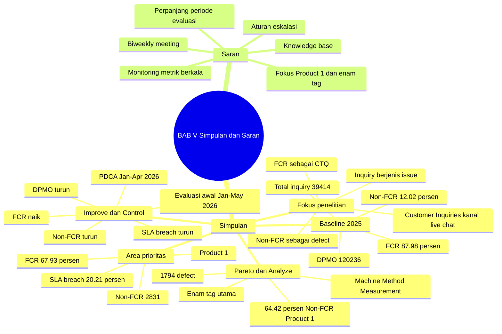

# BAB 5 - Summary Simpulan dan Saran

## Inti Satu Kalimat

BAB V menutup penelitian dengan menyatakan bahwa Lean Six Sigma melalui DMAIC dapat digunakan untuk membaca variasi FCR, menetapkan Product 1 sebagai area prioritas berbasis data, menemukan akar penyebab Non-FCR pada enam tag utama, menjalankan PDCA terbatas Jan-Apr 2026, dan menunjukkan indikasi perbaikan awal melalui FCR naik serta Non-FCR, DPMO, dan SLA breach turun pada evaluasi Jan-May 2026.

## Memory Hook

FCR sebagai CTQ -> Non-FCR sebagai defect -> Product 1 prioritas -> enam tag Pareto -> Machine, Method, Measurement -> PDCA Jan-Apr 2026 -> evaluasi awal Jan-May 2026 -> Control berkelanjutan.

## Mindmap BAB V

## Storyline BAB V

BAB V dimulai dengan mengulang posisi penelitian: penelitian ini menganalisis dan memperbaiki proses layanan pelanggan pada perusahaan SaaS dengan pendekatan Lean Six Sigma melalui DMAIC. Fokusnya adalah Customer Inquiries kanal live chat, khususnya inquiry berjenis issue. FCR ditetapkan sebagai CTQ, sedangkan Non-FCR diperlakukan sebagai defect.

Simpulan pertama menjawab kondisi baseline 2025. Dari 39.414 inquiry berjenis issue, sebanyak 34.675 inquiry berhasil diselesaikan pada kontak pertama, sehingga FCR agregat perusahaan sebesar 87,98%. Sebaliknya, 4.739 inquiry berstatus Non-FCR atau 12,02%. Dengan asumsi satu inquiry sebagai satu unit dan satu peluang defect, DPMO Non-FCR agregat adalah 120.236.

Simpulan berikutnya menjelaskan hasil stratifikasi. Product 1 menjadi area prioritas karena FCR-nya jauh lebih rendah, yaitu 67,93%, dengan 2.831 Non-FCR dan SLA breach 20,21%. Product 2 menjadi pembanding karena memiliki FCR 93,76% dan SLA breach 4,45%. Artinya, masalah tidak hanya berasal dari volume inquiry, tetapi juga karakteristik produk dan kompleksitas issue.

Pada Product 1, Pareto menunjukkan enam tag kontributor utama Non-FCR: REPORT ERP, PURCHASING, INVENTORY, ACCOUNTING, FINANCE, dan MASTER. Keenam tag ini menghasilkan 1.794 defect atau 64,42% dari Non-FCR Product 1. Bagian ini menjadi jawaban kuat untuk pertanyaan: area mana yang paling relevan untuk dianalisis lebih dalam.

Analyze menyimpulkan bahwa akar penyebab dominan Non-FCR pada Product 1 berkaitan dengan Machine, Method, dan Measurement. Contoh masalahnya adalah mismatch report dengan data transaksi, kendala journal dan settlement, ketidaksesuaian data stock, kelemahan validasi transaksi, bug logic sistem, serta kebutuhan manual query atau manual repair oleh tim pengembang.

Simpulan DMAIC menjelaskan fungsi setiap fase. Define menetapkan CTQ dan alur proses. Measure menghitung baseline dan menentukan prioritas. Analyze menemukan akar penyebab. Improve menjalankan PDCA terbatas Jan-Apr 2026 melalui biweekly meeting, issue tracker, tindak lanjut bug, knowledge base, dan aturan eskalasi. Control membaca evaluasi awal Jan-May 2026 melalui pemantauan metrik dan evaluasi per tag.

Evaluasi awal Product 1 menunjukkan indikasi perbaikan. FCR naik dari 67,93% pada baseline 2025 menjadi 72,21% pada implementasi PDCA Jan-Apr 2026 dan 73,74% pada evaluasi awal Jan-May 2026. Non-FCR turun dari 2.831 inquiry atau 32,07% menjadi 1.064 inquiry atau 26,26% pada evaluasi awal Jan-May 2026.

DPMO Product 1 turun dari 320.684 menjadi 262.586, sedangkan SLA breach turun dari 20,21% menjadi 14,56% pada evaluasi awal Jan-May 2026. Perubahan paling kuat terlihat pada MASTER dan FINANCE, yang memiliki proporsi bug dilakukan perbaikan tinggi dan peningkatan FCR paling kuat dibanding baseline 2025.

Namun, BAB V tetap menjaga kehati-hatian klaim. Product 1 belum mencapai target FCR 90%, dan tidak semua tag bergerak sama kuat. Karena itu, penelitian tidak berhenti pada klaim improvement awal, tetapi menekankan kebutuhan Control berkelanjutan.

Bagian Saran kemudian mengunci arah perbaikan lanjutan. Perusahaan disarankan melanjutkan monitoring FCR, Non-FCR, DPMO, SLA breach, total inquiry, dan pergerakan tag issue utama. Dashboard hanya diposisikan sebagai alat bantu visualisasi, sedangkan mekanisme kontrol utamanya adalah evaluasi metrik dan response plan.

Saran juga menekankan pentingnya biweekly meeting antara Customer Service dan tim pengembang sebagai mekanisme PDCA berkelanjutan. Forum ini digunakan untuk menentukan prioritas issue berdasarkan kontribusi defect, memantau status issue, menetapkan PIC, dan mengevaluasi apakah issue yang sudah dilakukan perbaikan masih muncul kembali.

Selain itu, perusahaan perlu memperkuat knowledge base, panduan penanganan issue, dan aturan eskalasi. Issue yang sudah memiliki pola penyelesaian perlu didokumentasikan agar Customer Service dapat menyelesaikan kasus serupa lebih cepat. Untuk issue teknis, informasi minimum eskalasi perlu diperjelas agar tindak lanjut tim pengembang lebih efektif.

Fokus jangka pendek tetap diarahkan pada Product 1 dan enam tag utama. MASTER dan FINANCE perlu dipertahankan sebagai contoh area perbaikan yang menunjukkan perubahan paling kuat, sedangkan REPORT ERP, PURCHASING, INVENTORY, dan ACCOUNTING tetap perlu dikendalikan karena kontribusi defect masih besar atau pergerakan FCR belum sekuat dua tag tersebut.

Untuk penelitian selanjutnya, BAB V menyarankan periode evaluasi diperpanjang, hubungan antara FCR, SLA breach, dan CSAT/complaint rate diteliti, serta penggunaan Control Chart atau Statistical Process Control dipertimbangkan untuk menguji stabilitas proses secara statistik.

## Angka Kunci BAB V

| Area | Metrik | Nilai | Makna |
|---|---:|---:|---|
| Baseline agregat 2025 | Total inquiry | 39.414 | Inquiry berjenis issue kanal live chat. |
| Baseline agregat 2025 | FCR | 34.675 atau 87,98% | Inquiry selesai pada kontak pertama. |
| Baseline agregat 2025 | Non-FCR | 4.739 atau 12,02% | Defect utama penelitian. |
| Baseline agregat 2025 | DPMO Non-FCR | 120.236 | Kapabilitas proses agregat sebelum prioritas ditetapkan. |
| Product 1 baseline 2025 | FCR | 67,93% | Menjadi area prioritas. |
| Product 1 baseline 2025 | Non-FCR | 2.831 inquiry atau 32,07% | Defect Product 1 sebelum PDCA. |
| Product 1 baseline 2025 | SLA breach | 20,21% | Dampak pendukung pada pemenuhan SLA 24 jam. |
| Pareto Product 1 | Enam tag utama | 1.794 defect atau 64,42% | Fokus Analyze dan Improve. |
| Product 1 evaluasi awal Jan-May 2026 | FCR | 73,74% | Indikasi perbaikan awal. |
| Product 1 evaluasi awal Jan-May 2026 | Non-FCR | 1.064 inquiry atau 26,26% | Defect rate menurun. |
| Product 1 evaluasi awal Jan-May 2026 | DPMO | 262.586 | Kapabilitas proses membaik. |
| Product 1 evaluasi awal Jan-May 2026 | SLA breach | 14,56% | Dampak operasional ikut membaik. |

## Jawaban RQ dari BAB V

| Rumusan Masalah | Jawaban Ringkas BAB V |
|---|---|
| RQ1: Bagaimana pola dan distribusi variasi FCR berdasarkan karakteristik inquiry? | Baseline dan stratifikasi menunjukkan variasi FCR tidak merata. Product 1 memiliki FCR 67,93%, lebih rendah dari Product 2 yang mencapai 93,76%, sehingga Product 1 menjadi area prioritas. |
| RQ2: Faktor proses apa yang berkontribusi terhadap variasi FCR? | Faktor dominan berada pada Machine, Method, dan Measurement, terutama mismatch data, logic sistem, validasi transaksi, manual query, manual repair, dan eskalasi teknis berulang. |
| RQ3: Bagaimana penerapan DMAIC dalam meningkatkan dan menstabilkan FCR? | DMAIC dipakai untuk menetapkan CTQ, mengukur baseline, memilih prioritas, menganalisis akar penyebab, menjalankan PDCA Jan-Apr 2026, dan membaca evaluasi awal Jan-May 2026. Hasilnya FCR Product 1 naik, sedangkan Non-FCR, DPMO, dan SLA breach turun. |
| RQ4: Usulan perbaikan apa yang direkomendasikan untuk mendukung SLA 24 jam? | Control berkelanjutan melalui monitoring metrik, response plan, issue tracker, biweekly meeting, knowledge base, aturan eskalasi, dan fokus lanjutan pada Product 1 serta enam tag utama. |

## Simpulan Final Penelitian

| Poin | Inti Simpulan | Catatan Penguasaan |
|---|---|---|
| Fokus penelitian | FCR adalah CTQ, Non-FCR adalah defect. | SLA breach bukan defect utama, tetapi dampak pendukung. |
| Baseline | Proses layanan pelanggan masih memiliki defect operasional yang cukup tinggi. | DPMO Non-FCR agregat 120.236. |
| Area prioritas | Product 1 dipilih karena FCR rendah dan SLA breach tinggi. | Product 1 bukan asumsi awal, melainkan hasil Measure. |
| Pareto | Enam tag utama menyumbang 64,42% Non-FCR Product 1. | Tag prioritas menjadi jembatan ke Analyze dan Improve. |
| Root cause | Dominan pada Machine, Method, Measurement. | Masalah bukan hanya kapasitas agen. |
| Improve | PDCA Jan-Apr 2026 dilakukan melalui koordinasi Customer Service dan tim pengembang. | Evidence berasal dari issue tracker, biweekly meeting, dan tindak lanjut bug. |
| Control | Evaluasi awal menunjukkan indikasi perbaikan, tetapi belum final. | Product 1 belum mencapai target FCR 90%. |
| Saran | Perbaikan harus dijaga melalui monitoring, response plan, standardisasi, dan eskalasi. | Control adalah mekanisme menjaga keberlanjutan. |

## Saran Operasional

| Saran | Fungsi |
|---|---|
| Monitoring berkala FCR, Non-FCR, DPMO, SLA breach, total inquiry, dan tag utama. | Menjaga perubahan kinerja tetap terpantau. |
| Dashboard sebagai alat bantu visualisasi. | Membuat tren dan deviasi lebih cepat terbaca. |
| Response plan saat FCR turun, DPMO naik, SLA breach naik, atau tag utama berulang. | Menghindari perbaikan berhenti sebagai evaluasi pasif. |
| Biweekly meeting Customer Service dan tim pengembang. | Menjaga PDCA tetap berjalan lintas fungsi. |
| Prioritas issue berdasarkan kontribusi defect dan status tindak lanjut. | Memastikan perbaikan fokus pada masalah terbesar. |
| Knowledge base dan panduan penanganan issue. | Mengurangi eskalasi berulang dan memperbesar peluang FCR. |
| Aturan eskalasi dan informasi minimum eskalasi. | Mempercepat tindak lanjut untuk issue teknis. |
| Fokus Product 1 dan enam tag utama. | Menjaga fokus jangka pendek pada area yang paling berdampak. |

## Catatan Untuk Sidang

Jika ditanya "apa kontribusi utama penelitian ini?", jawabannya:

Penelitian ini menunjukkan cara menggunakan DMAIC untuk mengubah masalah FCR menjadi masalah proses yang terukur. Non-FCR diposisikan sebagai defect, Product 1 dan enam tag prioritas dipilih berbasis data, akar penyebab dibaca melalui Fishbone 6M, perbaikan dilakukan melalui PDCA, dan hasil awal dievaluasi dengan FCR, Non-FCR, DPMO, SLA breach, serta evaluasi per tag.

Jika ditanya "apakah improvement ini pasti akibat PDCA?", jawabannya:

Penelitian ini tidak mengklaim kausalitas mutlak. Hasil dibaca sebagai indikasi perbaikan awal karena perubahan agregat Product 1 didukung oleh penurunan Non-FCR, DPMO, dan SLA breach, serta diperkuat oleh evidence tag-level, terutama MASTER dan FINANCE yang memiliki proporsi perbaikan tinggi dan delta FCR terbesar.

Jika ditanya "kenapa SLA breach bukan defect utama?", jawabannya:

Karena defect dalam penelitian ini didefinisikan sebagai kegagalan menyelesaikan inquiry pada kontak pertama, yaitu Non-FCR. SLA breach dipakai sebagai metrik dampak pendukung karena Non-FCR dapat memicu rework, eskalasi, dan keterlambatan penyelesaian inquiry.

Jika ditanya "apa tindak lanjut praktis dari penelitian ini?", jawabannya:

Perusahaan perlu mempertahankan Control melalui monitoring metrik, response plan, issue tracker, biweekly meeting, knowledge base, aturan eskalasi, dan fokus lanjutan pada Product 1 serta enam tag utama. Perbaikan tidak boleh berhenti pada implementasi awal, tetapi harus menjadi siklus evaluasi berkelanjutan.

## Catatan Koherensi

- BAB V sudah konsisten dengan BAB IV karena menggunakan kronologi 2025 sebagai baseline, Jan-Apr 2026 sebagai implementasi PDCA, dan Jan-May 2026 sebagai evaluasi awal.
- BAB V tidak mengklaim Product 1 sejak awal, tetapi menyatakan Product 1 sebagai hasil stratifikasi.
- BAB V tetap menempatkan Non-FCR sebagai defect utama dan SLA breach sebagai dampak pendukung.
- BAB V sudah menyebut FCR, Non-FCR, DPMO, dan SLA breach sebagai hasil evaluasi utama.
- BAB V menjaga kehati-hatian klaim dengan memakai bahasa "indikasi perbaikan" dan mengakui bahwa target FCR 90% belum tercapai.
- BAB V menyambungkan hasil penelitian ke saran Control berkelanjutan, bukan hanya menyimpulkan angka perbaikan.

