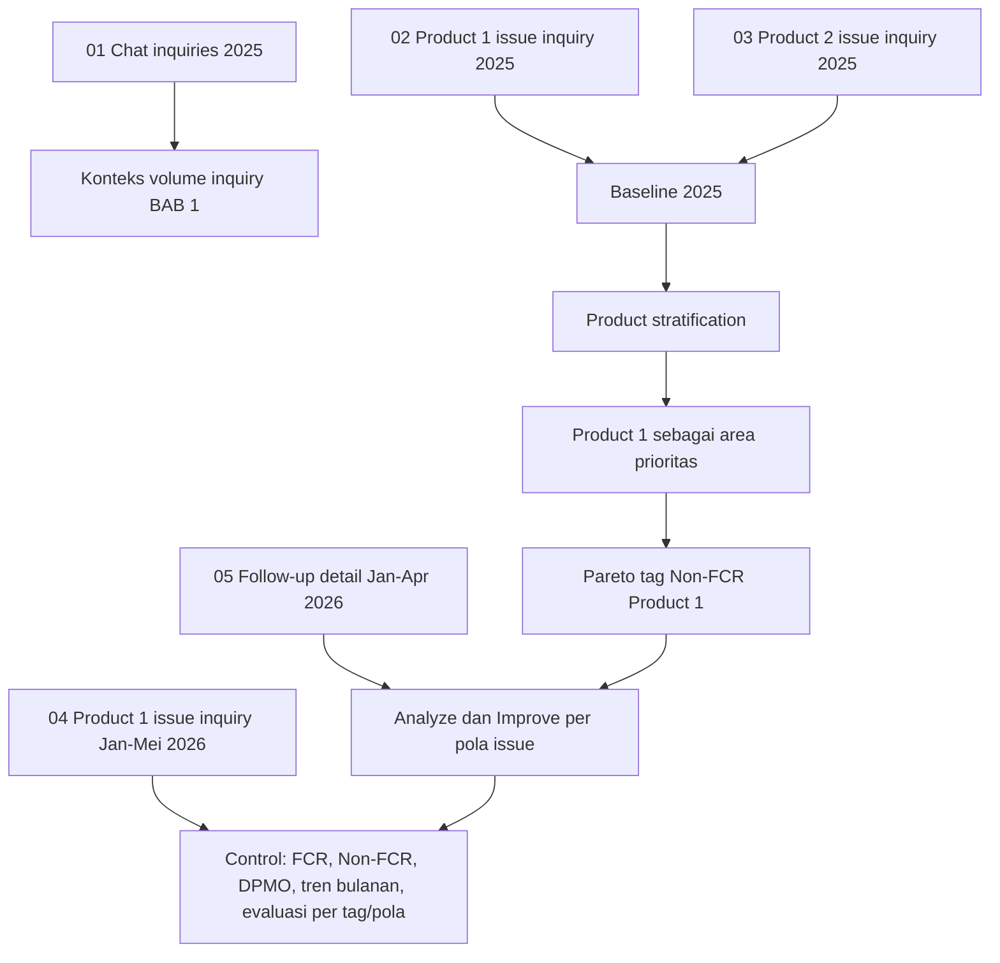

# Data Reproduksi Perhitungan Riset

Folder paket data:

`/Users/ahmadreza/Documents/1. Projects/Careline Analysis/research_metrics_calculator/data`

Paket ini berisi 5 file data yang cukup untuk mereproduce perhitungan utama dalam riset. Data Juni 2026 tidak dimasukkan karena belum menjadi bagian dari draft.

## Daftar File

| No | File dalam paket | Sumber asal | Fungsi dalam riset |
|---:|---|---|---|
| 1 | `01_chat_inquiries_2025.csv` | Gabungan 12 file `chat_inquiries_2025_*.csv` | Konteks volume Customer Inquiries kanal chat tahun 2025. |
| 2 | `02_issue_inquiry_detail_2025_product_1.csv` | `issue_inquiry_detail_2025_product_1.csv` | Baseline Product 1, Pareto tag, dan baseline before improvement. |
| 3 | `03_issue_inquiry_detail_2025_product_2.csv` | `issue_inquiry_detail_2025_product_2.csv` | Pembanding Product 1 vs Product 2 dan baseline agregat. |
| 4 | `04_issue_inquiry_detail_2026_jan_may_product_1.csv` | `ticket_detail_2026_01_05_product_1.csv` | Evaluasi awal Jan-Mei 2026 untuk Product 1. |
| 5 | `05_issue_followup_detail_2026_jan_apr_product_1.csv` | `dev_subtag_fixing_detail_2026.csv` | Evidence Analyze-Improve: pola issue, action item, dan status tindak lanjut. |

Catatan: istilah narasi tesis tetap memakai `inquiry` dan `inquiry berjenis issue`. Kolom `Ticket Number` tetap dipakai karena itu nama field asli dari sistem dan diperlukan untuk deduplicate.

## Lineage Data

## Aturan Global Perhitungan

| Elemen | Rule |
|---|---|
| Unit analisis | Satu inquiry berjenis issue. |
| Deduplicate | Gunakan kolom sumber `Ticket Number`; urutkan berdasarkan `Created Date`, lalu ambil record pertama. |
| Filter utama | `Services = Issue`. |
| Product 1 | `Product Type = ESB Core`, ditulis sebagai Product 1 dalam tesis. |
| Product 2 | `Product Type = ESB OMS`, ditulis sebagai Product 2 dalam tesis. |
| FCR | `Need Development Finish Notes` terbaca kosong/NA oleh parser data. |
| Non-FCR | `Need Development Finish Notes` terisi. |
| Defect | Inquiry berjenis issue yang masuk Non-FCR. |
| Opportunity per unit | 1. |
| DPMO | `(Non-FCR / Total inquiry berjenis issue) * 1.000.000`. |
| SLA breach | Non-FCR dengan durasi `Repaired Ticket Date - Created Date > 24 jam`. |

## Cara Hitung Per Bagian Riset

### 1. Konteks Volume Customer Inquiries 2025

File: `01_chat_inquiries_2025.csv`

Logic:

1. Hitung seluruh baris data.
2. Untuk volume bulanan, group by `source_month`.
3. Data ini hanya konteks volume chat, bukan denominator FCR/DPMO.

Expected output:

| Metrik | Nilai |
|---|---:|
| Total chat inquiries 2025 | 169.288 |
| Volume bulanan tertinggi | 16.377 pada 2025-12 |

### 2. Baseline Agregat 2025

File:

- `02_issue_inquiry_detail_2025_product_1.csv`
- `03_issue_inquiry_detail_2025_product_2.csv`

Logic:

1. Gabungkan Product 1 dan Product 2.
2. Parse `Created Date` dan `Repaired Ticket Date`.
3. Deduplicate berdasarkan `Ticket Number`.
4. Filter `Services = Issue`.
5. Hitung FCR, Non-FCR, FCR rate, Non-FCR rate, dan DPMO.

Expected output:

| Metrik | Nilai |
|---|---:|
| Total inquiry berjenis issue | 39.414 |
| FCR | 34.675 |
| Non-FCR | 4.739 |
| FCR rate | 87,98% |
| Non-FCR rate | 12,02% |
| DPMO Non-FCR | 120.236 |

### 2A. Cara Hitung Trend Chart Background BAB 1 - Gambar 1.1

Nama gambar di draft:

`Gambar 1.1 Fluktuasi Non First Call Resolution dan SLA Breach`

File:

- `02_issue_inquiry_detail_2025_product_1.csv`
- `03_issue_inquiry_detail_2025_product_2.csv`

Catatan penting:

Trend chart ini tidak memakai `01_chat_inquiries_2025.csv`, karena chart perlu membaca status FCR/Non-FCR dan SLA breach. Data chat hanya dipakai sebagai konteks volume Customer Inquiries, sedangkan Gambar 1.1 memakai data inquiry berjenis issue.

Logic:

1. Gabungkan data Product 1 dan Product 2 tahun 2025.
2. Parse `Created Date` dan `Repaired Ticket Date`.
3. Deduplicate berdasarkan `Ticket Number`.
4. Filter `Services = Issue`.
5. Buat kolom bulan dari `Created Date`, misalnya `2025-01`.
6. Tentukan FCR: `Need Development Finish Notes` kosong/NA.
7. Tentukan Non-FCR: `Need Development Finish Notes` terisi.
8. Hitung `repair_duration_hours = Repaired Ticket Date - Created Date`.
9. Tentukan SLA breach: inquiry Non-FCR dengan `repair_duration_hours > 24`.
10. Group by bulan, lalu hitung:
    - `total_issue_inquiry`
    - `fcr_inquiry`
    - `non_fcr_inquiry`
    - `sla_breach_inquiry`
    - `non_fcr_rate = non_fcr_inquiry / total_issue_inquiry * 100`
    - `sla_breach_rate = sla_breach_inquiry / total_issue_inquiry * 100`

Struktur chart:

| Elemen chart | Data |
|---|---|
| X-axis | Bulan `2025-01` sampai `2025-12`. |
| Bar abu-abu | Total inquiry berjenis issue per bulan. |
| Garis oranye | Non-FCR rate per bulan. |
| Garis merah | SLA breach rate per bulan. |

Expected output Gambar 1.1:

| Bulan | Total issue inquiry | FCR | Non-FCR | SLA breach | Non-FCR rate | SLA breach rate |
|---|---:|---:|---:|---:|---:|---:|
| 2025-01 | 2.883 | 2.530 | 353 | 249 | 12,24% | 8,64% |
| 2025-02 | 2.971 | 2.626 | 345 | 248 | 11,61% | 8,35% |
| 2025-03 | 3.520 | 3.197 | 323 | 220 | 9,18% | 6,25% |
| 2025-04 | 3.286 | 3.004 | 282 | 210 | 8,58% | 6,39% |
| 2025-05 | 3.428 | 3.078 | 350 | 245 | 10,21% | 7,15% |
| 2025-06 | 3.241 | 2.857 | 384 | 272 | 11,85% | 8,39% |
| 2025-07 | 3.453 | 3.004 | 449 | 297 | 13,00% | 8,60% |
| 2025-08 | 3.165 | 2.769 | 396 | 256 | 12,51% | 8,09% |
| 2025-09 | 3.356 | 2.836 | 520 | 315 | 15,49% | 9,39% |
| 2025-10 | 3.818 | 3.274 | 544 | 354 | 14,25% | 9,27% |
| 2025-11 | 3.103 | 2.713 | 390 | 245 | 12,57% | 7,90% |
| 2025-12 | 3.190 | 2.787 | 403 | 234 | 12,63% | 7,34% |

Expected narrative:

- FCR bulanan berada pada rentang 84,51% sampai 91,42%.
- Non-FCR rate bulanan berada pada rentang 8,58% sampai 15,49%.
- SLA breach rate bulanan berada pada rentang 6,25% sampai 9,39%.
- Volume inquiry berjenis issue tertinggi terjadi pada 2025-10 dengan 3.818 inquiry.

### 3. Stratifikasi Product 2025

File:

- `02_issue_inquiry_detail_2025_product_1.csv`
- `03_issue_inquiry_detail_2025_product_2.csv`

Logic:

1. Pakai dataset baseline 2025 yang sudah dideduplicate dan difilter `Services = Issue`.
2. Group by `Product Type`.
3. Bandingkan total issue, FCR, Non-FCR, FCR rate, dan DPMO.

Expected output:

| Product | Total issue | FCR | Non-FCR | FCR rate | DPMO |
|---|---:|---:|---:|---:|---:|
| Product 1 | 8.828 | 5.997 | 2.831 | 67,93% | 320.684 |
| Product 2 | 30.586 | 28.678 | 1.908 | 93,76% | 62.381 |

Interpretasi:

Product 1 menjadi area prioritas karena FCR jauh lebih rendah dan DPMO jauh lebih tinggi dibanding Product 2.

### 4. Pareto Tag Non-FCR Product 1

File:

- `02_issue_inquiry_detail_2025_product_1.csv`

Logic:

1. Filter `Product Type = ESB Core`.
2. Filter `Services = Issue`.
3. Deduplicate berdasarkan `Ticket Number`.
4. Ambil hanya Non-FCR.
5. Hitung frekuensi berdasarkan `Tags`.
6. Urutkan dari count terbesar.
7. Hitung cumulative percentage dari total tag Non-FCR yang memiliki nilai tag.

Expected top contributor:

| Rank | Tag | Count | Cum. pct |
|---:|---|---:|---:|
| 1 | REPORT ERP | 380 | 13,64% |
| 2 | PURCHASING | 380 | 27,29% |
| 3 | INVENTORY | 377 | 40,83% |
| 4 | ACCOUNTING | 269 | 50,48% |
| 5 | FINANCE | 195 | 57,49% |
| 6 | MASTER | 193 | 64,42% |

Catatan:

Angka 64,42% berasal dari denominator Pareto tag yang memiliki nilai tag, bukan langsung dari total Non-FCR Product 1 bila ada baris tanpa tag.

### 5. Analyze dan Improve Per Pola Issue

File:

- `05_issue_followup_detail_2026_jan_apr_product_1.csv`

Logic:

1. Satu baris merepresentasikan satu action item/pola follow-up.
2. `KEY` digunakan sebagai tag utama.
3. `sub_tag` digunakan sebagai pola issue.
4. `Root Cause` dan `Solution` digunakan untuk membaca akar masalah dan tindakan.
5. `fix_status_inferred` digunakan untuk membaca status tindak lanjut.
6. `Sudah dilakukan perbaikan` = `fix_status_inferred` mengandung `Fixed`.
7. `Belum terkonfirmasi` = selain `Fixed`.

Expected raw support:

| Metrik | Nilai |
|---|---:|
| Total action item Jan-Apr 2026 | 638 |
| Action item dengan status Fixed | 476 |

Catatan draft saat ini:

Tabel utama Improve hanya menampilkan pola issue yang selaras dengan pembacaan Control, yaitu pola yang menunjukkan pergerakan FCR positif pada evaluasi Jan-Mei 2026. Detail mentah tetap tersedia pada file ini.

### 5A. Cara Hitung Tabel 4.3 Status Tindak Lanjut Improve per Pola Issue

File:

- `05_issue_followup_detail_2026_jan_apr_product_1.csv`

Tujuan Tabel 4.3:

Menunjukkan pola issue yang masuk sebagai hasil Improve dan memiliki evidence tindak lanjut pada periode Jan-Apr 2026. Tabel ini tidak menghitung dampak FCR; dampak FCR dibaca pada Tabel 4.7.

Logic:

1. Ambil data dari `05_issue_followup_detail_2026_jan_apr_product_1.csv`.
2. Gunakan `KEY` sebagai `Tag`.
3. Gunakan `sub_tag` sebagai basis `Pola issue`, lalu rapikan label agar sesuai istilah thesis.
4. Satu baris data dihitung sebagai satu `Action item`.
5. Kelompokkan data berdasarkan pasangan `Tag` dan `Pola issue`.
6. Hitung `Action item` = jumlah baris pada pasangan `Tag` dan `Pola issue`.
7. Hitung `Sudah dilakukan perbaikan` = jumlah baris dengan `fix_status_inferred` mengandung `Fixed`.
8. Hitung `Belum terkonfirmasi` = `Action item - Sudah dilakukan perbaikan`.
9. Hitung `Persentase perbaikan` = `Sudah dilakukan perbaikan / Action item * 100`.
10. Tampilkan hanya pola issue yang juga masuk pembacaan Control positif pada Tabel 4.7, agar Improve dan Control konsisten dalam alur riset.

Rule `Tindak lanjut Act`:

| Kondisi | Tindak lanjut Act |
|---|---|
| Persentase perbaikan = 100% | Standarkan pola penyelesaian dan pantau kemunculan ulang. |
| Persentase perbaikan >= 75% dan < 100% | Standarkan item selesai; validasi item belum terkonfirmasi. |
| Persentase perbaikan >= 50% dan < 75% | Bahas ulang item belum terkonfirmasi pada forum berikutnya. |
| Persentase perbaikan < 50% | Masukkan kembali sebagai prioritas PDCA berikutnya. |

Expected output Tabel 4.3:

| Tag | Pola issue | Action item | Sudah dilakukan perbaikan | Belum terkonfirmasi | Persentase perbaikan |
|---|---|---:|---:|---:|---:|
| REPORT ERP | Balance Sheet | 11 | 7 | 4 | 63,6% |
| PURCHASING | Purchase Invoice | 23 | 21 | 2 | 91,3% |
| PURCHASING | Purchase Order | 18 | 12 | 6 | 66,7% |
| PURCHASING | Purchase Payment | 14 | 8 | 6 | 57,1% |
| PURCHASING | Purchase Request | 11 | 9 | 2 | 81,8% |
| PURCHASING | Advance Purchase | 6 | 5 | 1 | 83,3% |
| PURCHASING | Simple Purchase | 5 | 4 | 1 | 80,0% |
| INVENTORY | Goods Receipt | 17 | 14 | 3 | 82,4% |
| INVENTORY | Item Journal | 9 | 7 | 2 | 77,8% |
| INVENTORY | Stock List | 7 | 6 | 1 | 85,7% |
| ACCOUNTING | GL/Journal/PNL/BS/TB | 17 | 12 | 5 | 70,6% |
| ACCOUNTING | General Journal | 13 | 6 | 7 | 46,2% |
| ACCOUNTING | General Ledger | 10 | 5 | 5 | 50,0% |
| ACCOUNTING | Release Payment | 6 | 4 | 2 | 66,7% |
| FINANCE | Supplier Payable | 8 | 7 | 1 | 87,5% |
| MASTER | Master BOM | 5 | 5 | 0 | 100,0% |
| MASTER | Master Product | 5 | 4 | 1 | 80,0% |

Catatan:

Angka pada Tabel 4.3 adalah evidence pelaksanaan Improve, bukan bukti akhir keberhasilan. Keberhasilan akhir dibaca pada Tabel 4.7 melalui perubahan FCR per pola issue.

### 6. Evaluasi Awal Product 1 Jan-Mei 2026

File:

- `04_issue_inquiry_detail_2026_jan_may_product_1.csv`

Logic:

1. Baca file dengan melewati dua baris awal; header berada pada baris ketiga.
2. Parse `Created Date`.
3. Deduplicate berdasarkan `Ticket Number`.
4. Filter `Services = Issue`.
5. Hitung FCR, Non-FCR, FCR rate, dan DPMO.
6. Untuk tren bulanan, group by bulan dari `Created Date`.

Expected output:

| Periode | Total issue | FCR | Non-FCR | FCR rate | DPMO |
|---|---:|---:|---:|---:|---:|
| Jan-Apr 2026 | 3.170 | 2.289 | 881 | 72,21% | 277.918 |
| Jan-Mei 2026 | 4.052 | 2.988 | 1.064 | 73,74% | 262.586 |

Expected monthly output:

| Bulan | Total issue | FCR | Non-FCR | FCR rate | DPMO |
|---|---:|---:|---:|---:|---:|
| 2026-01 | 807 | 574 | 233 | 71,13% | 288.724 |
| 2026-02 | 788 | 539 | 249 | 68,40% | 315.990 |
| 2026-03 | 725 | 542 | 183 | 74,76% | 252.414 |
| 2026-04 | 850 | 634 | 216 | 74,59% | 254.118 |
| 2026-05 | 882 | 699 | 183 | 79,25% | 207.483 |

### 7. Before-After Product 1

File:

- Before: `02_issue_inquiry_detail_2025_product_1.csv`
- After/evaluasi awal: `04_issue_inquiry_detail_2026_jan_may_product_1.csv`

Logic:

1. Before = Product 1 tahun 2025.
2. Implementasi PDCA = Jan-Apr 2026.
3. Evaluasi awal = Jan-Mei 2026.
4. Bandingkan FCR rate dan DPMO.

Expected output:

| Periode | Total issue | FCR | Non-FCR | FCR rate | DPMO |
|---|---:|---:|---:|---:|---:|
| Baseline 2025 | 8.828 | 5.997 | 2.831 | 67,93% | 320.684 |
| Implementasi PDCA Jan-Apr 2026 | 3.170 | 2.289 | 881 | 72,21% | 277.918 |
| Evaluasi awal Jan-Mei 2026 | 4.052 | 2.988 | 1.064 | 73,74% | 262.586 |

Pembacaan:

- FCR naik dari 67,93% ke 73,74%.
- DPMO turun dari 320.684 ke 262.586.
- Penurunan DPMO = 58.098 atau sekitar 18,12%.

## Checklist Reproduce

| Step | Output yang harus sama |
|---|---|
| Hitung chat 2025 | Total 169.288 baris. |
| Hitung baseline agregat 2025 | Total issue 39.414, FCR 34.675, Non-FCR 4.739, DPMO 120.236. |
| Hitung Product 1 baseline | Total issue 8.828, FCR 5.997, Non-FCR 2.831, FCR 67,93%. |
| Hitung Product 2 baseline | Total issue 30.586, FCR 28.678, Non-FCR 1.908, FCR 93,76%. |
| Hitung Pareto Product 1 | Top six tag mencapai 64,42% cumulative Pareto. |
| Hitung Jan-Mei 2026 | Total issue 4.052, FCR 2.988, Non-FCR 1.064, FCR 73,74%. |
| Hitung before-after | FCR naik 5,81 percentage point dan DPMO turun 18,12%. |
