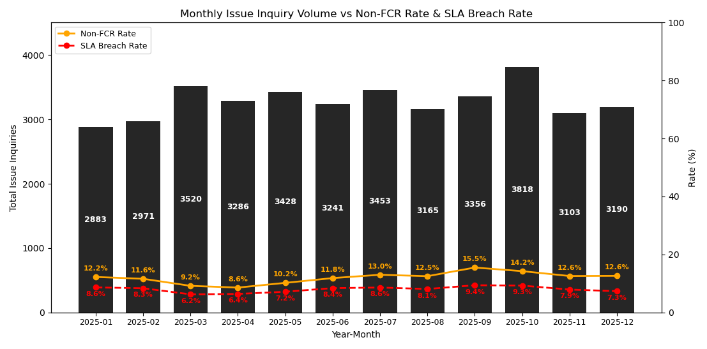
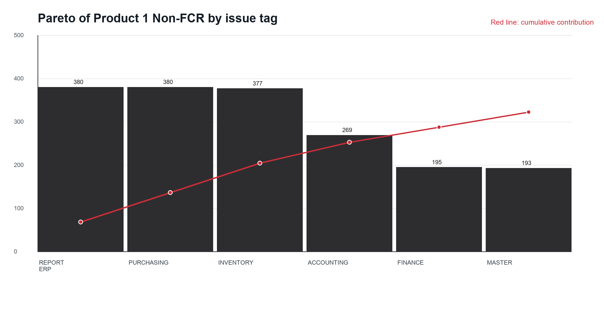

## 4.1. Plan: Baseline Condition and Priority Defects

The Plan stage combined the Define, Measure, and diagnostic elements of DMAIC. The process begins when a customer submits an issue through live chat. Customer Service identifies the problem, attempts first-contact resolution, and closes the inquiry when the answer is complete. An inquiry becomes Non-FCR when it requires technical validation, manual repair, escalation, or additional customer interaction. SLA breach is treated as an operational consequence rather than the main defect.

The 2025 baseline contained 39,414 issue inquiries. Monthly volume and defect performance fluctuated throughout the year, showing that the resolution process was not stable.

**Figure 1. Baseline fluctuation of Non-FCR and SLA breach in 2025.**

Product-level stratification identified a substantial difference between the two anonymized products.

**Table 2. Baseline performance by product in 2025.**

| Product | Total inquiry | FCR | Non-FCR | FCR rate | SLA breach | SLA breach rate |
| --- | ---: | ---: | ---: | ---: | ---: | ---: |
| Product 1 | 8,828 | 5,997 | 2,831 | 67.93% | 1,784 | 20.21% |
| Product 2 | 30,586 | 28,678 | 1,908 | 93.76% | 1,361 | 4.45% |
| Total | 39,414 | 34,675 | 4,739 | 87.98% | 3,145 | 7.98% |

Table 2 answers the product-level component of RQ1. Product 1 produced 2,831 Non-FCR defects and had an FCR rate of only 67.93%, compared with 93.76% for Product 2. Product 1 also had a 20.21% SLA-breach rate. The improvement study therefore focused on Product 1.

Pareto analysis then identified six Product 1 issue categories that contained most of the priority defects.

**Figure 2. Pareto of Product 1 Non-FCR by issue category.**

REPORT ERP, PURCHASING, INVENTORY, ACCOUNTING, FINANCE, and MASTER contributed 1,794 defects, or 64.42% of Product 1 Non-FCR. Fishbone 6M analysis showed that the dominant causes were not primarily agent capacity. Machine, Method, and Measurement were more prominent, including report-query and settlement logic, validation rules, queue procedures, stock calculations, and data mismatches across source transactions and reports. These results answer RQ1 by locating the defects and identifying the dominant root-cause dimensions.
