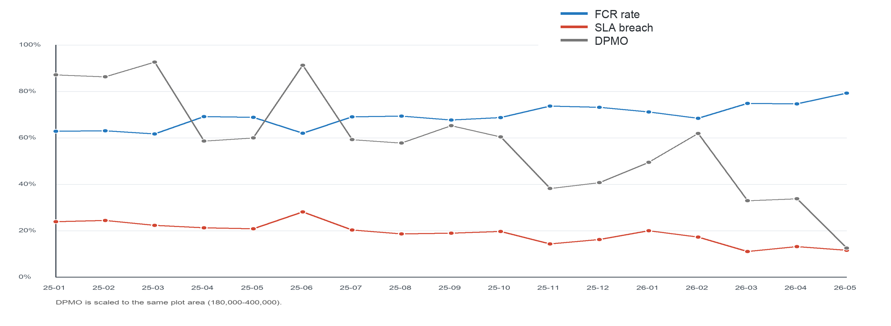

## 4.3. Check: Performance and Issue-Category Analysis

The Check stage evaluated issue-category and overall Product 1 performance. Table 3 combines dominant root-cause dimensions, corrective-action evidence, and FCR movement.

**Table 3. Root-cause dimensions, improvement evidence, and post-improvement FCR movement.**

| Tag | Dominant 6M | Fixed action items | FCR movement | Control reading |
| --- | --- | ---: | --- | --- |
| REPORT ERP | Machine, Measurement | 59/86 | 47.12% -> 55.60% (+8.49 pp) | Moderate improvement |
| PURCHASING | Machine, Method | 63/82 | 75.72% -> 78.99% (+3.27 pp) | Moderate improvement |
| INVENTORY | Machine, Measurement | 50/63 | 73.35% -> 74.83% (+1.48 pp) | Moderate improvement |
| ACCOUNTING | Machine, Measurement | 60/95 | 64.59% -> 61.90% (-2.68 pp) | Slight decline; monitor |
| FINANCE | Machine, Method | 44/54 | 51.13% -> 61.31% (+10.18 pp) | Strong improvement |
| MASTER | Machine, Method, Man | 25/29 | 71.66% -> 83.86% (+12.20 pp) | Strong improvement |

FINANCE and MASTER showed the strongest FCR gains, while REPORT ERP, PURCHASING, and INVENTORY recorded moderate improvement. ACCOUNTING declined slightly and therefore remained a control priority. The mixed category results demonstrate why an overall average should not be used as the only decision basis.

Overall Product 1 performance nevertheless moved in a favorable direction.

**Table 4. Product 1 baseline, PDCA implementation, and early evaluation.**

| Period | FCR | Non-FCR | DPMO | SLA breach | Avg. inquiry/month |
| --- | ---: | ---: | ---: | ---: | ---: |
| Baseline 2025 | 67.93% | 2,831 (32.07%) | 320,684 | 20.21% | 735.67 |
| PDCA Jan-Apr 2026 | 72.21% | 881 (27.79%) | 277,918 | 15.39% | 792.50 |
| Early evaluation Jan-May 2026 | 73.74% | 1,064 (26.26%) | 262,586 | 14.56% | 810.40 |

FCR increased from 67.93% at baseline to 73.74% in the early evaluation. The Non-FCR rate decreased from 32.07% to 26.26%, DPMO decreased from 320,684 to 262,586, and SLA breach decreased from 20.21% to 14.56%. These movements occurred while average monthly issue volume increased from 735.67 to 810.40.

**Figure 3. Product 1 monthly FCR, DPMO, and SLA-breach trend, January 2025-May 2026.**

The monthly pattern improved particularly from March to May 2026. However, FCR had already begun improving near the end of 2025. The findings should therefore be interpreted as an evidence-supported early indication rather than causal proof that every change resulted solely from PDCA. Together, the category and overall results answer RQ2 by showing how the improvement process is associated with early movement in FCR, Non-FCR, DPMO, and SLA-breach performance.
