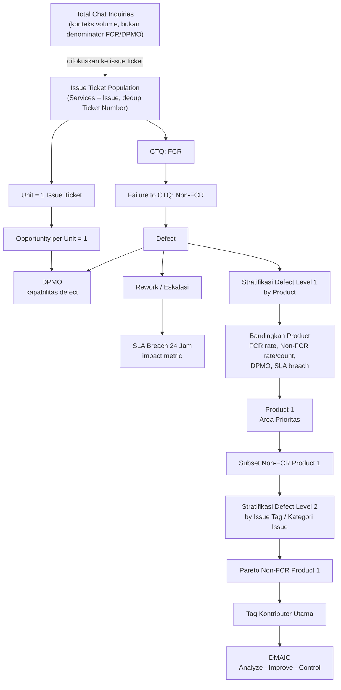

# Relasi Metrik BAB 1-3

## Inti Satu Kalimat

Metrik dalam BAB I sampai BAB III membentuk rantai logis: issue ticket menjadi populasi pengukuran, FCR menjadi CTQ, Non-FCR menjadi defect, DPMO menjadi ukuran kapabilitas defect, SLA breach menjadi metrik dampak pendukung, lalu defect distratifikasi bertingkat: pertama pada level produk untuk memilih area prioritas, kemudian pada level issue tag di Product 1 untuk menentukan fokus Analyze dan Improve.

## Peta Besar Metrik

## Hirarki Kedudukan Metrik

| Level | Metrik/Konsep | Kedudukan dalam Riset | Fungsi Utama |
|---|---|---|---|
| Konteks volume | Customer Inquiries / chat inquiries | Volume interaksi chat yang lebih luas dari issue ticket. | Memberi konteks beban layanan, bukan denominator FCR/DPMO. |
| Unit proses | Issue ticket | Objek yang dihitung dan dianalisis. | Menjadi basis FCR, Non-FCR, SLA breach, dan DPMO. |
| CTQ | First Call Resolution (FCR) | Critical to Quality utama. | Mengukur efektivitas penyelesaian inquiry pada kontak pertama. |
| Defect | Non-FCR | Representasi kegagalan CTQ. | Menunjukkan inquiry yang tidak selesai pada kontak pertama. |
| Opportunity | Opportunity per unit = 1 | Asumsi operasional DPMO. | Setiap inquiry punya satu peluang gagal selesai pada kontak pertama. |
| Kapabilitas proses | DPMO Non-FCR | Ukuran kualitas proses dalam perspektif Six Sigma. | Mengubah Non-FCR menjadi ukuran defect per satu juta peluang. |
| Dampak pendukung | SLA breach 24 jam | Metrik dampak operasional. | Membaca konsekuensi keterlambatan penyelesaian inquiry. |
| Beban proses | Total inquiry / total issue ticket | Volume kerja proses layanan. | Menunjukkan skala beban dan risiko saat ekspansi. |
| Dimensi stratifikasi level 1 | Produk | Variabel pemecah masalah pada level produk. | Menentukan produk prioritas berdasarkan FCR terendah, Non-FCR rate/count, DPMO, dan SLA breach. |
| Dimensi stratifikasi level 2 | Issue tag dan kategori issue | Variabel pemecah masalah di dalam Product 1. | Menentukan tag kontributor Non-FCR terbesar melalui Pareto. |
| Prioritas | Pareto count dan kumulatif | Alat pemilihan fokus setelah Product 1 ditetapkan. | Memilih kontributor Non-FCR terbesar untuk Analyze dan Improve. |
| Acuan kinerja | Target FCR 90% | Benchmark internal. | Menjadi acuan arah perbaikan, bukan satu-satunya ukuran keberhasilan. |

## Definisi Operasional

| Metrik | Definisi dalam Riset | Formula / Cara Baca |
|---|---|---|
| Total chat inquiries | Jumlah seluruh baris interaksi chat pada periode tertentu. | Konteks volume layanan, bukan denominator FCR/DPMO. |
| Total issue ticket | Jumlah ticket dengan `Services = Issue` setelah deduplicate `Ticket Number`. | Denominator resmi FCR, Non-FCR, DPMO, dan SLA breach. |
| FCR | Ticket yang selesai pada interaksi chat pertama tanpa follow-up atau eskalasi tambahan. | FCR ticket / total issue ticket. |
| FCR rate | Persentase issue ticket yang FCR. | FCR rate = FCR / total issue ticket x 100%. |
| Non-FCR | Ticket yang tidak selesai pada kontak pertama. | Non-FCR = total issue ticket - FCR. |
| Non-FCR rate | Persentase ticket yang gagal mencapai FCR. | Non-FCR rate = Non-FCR / total issue ticket x 100%. |
| Defect | Kegagalan proses memenuhi CTQ. | Dalam riset ini, defect = Non-FCR. |
| Unit | Satuan peluang yang dianalisis. | Dalam riset ini, unit = satu issue ticket. |
| Opportunity per unit | Peluang terjadinya defect pada satu unit. | Dalam riset ini, opportunity per unit = 1. |
| DPMO | Defect per satu juta opportunity. | DPMO = defect / (unit x opportunity per unit) x 1.000.000. |
| SLA breach 24 jam | Ticket yang melewati standar resolusi 24 jam. | SLA breach rate = ticket breach / total issue ticket x 100%. |
| Product | Kategori produk yang melekat pada ticket. | Digunakan untuk seleksi area prioritas level produk. |
| Issue tag / kategori issue | Kategori issue yang melekat pada ticket. | Digunakan untuk Pareto Non-FCR di dalam Product 1. |
| Pareto kumulatif | Akumulasi kontribusi defect dari kategori terbesar ke terkecil. | Menentukan prioritas tag setelah area produk dipilih. |

## Fungsi Metrik per BAB

| Metrik | BAB I | BAB II | BAB III |
|---|---|---|---|
| Customer Inquiries | Dipakai untuk menunjukkan konteks masalah layanan pelanggan SaaS. | Didukung oleh teori Customer Service dan customer service demand. | Dipakai sebagai konteks volume, bukan denominator utama. |
| Issue ticket | Dipakai untuk membatasi inquiry yang dianalisis pada masalah produk kanal chat. | Menjadi konteks operasional Customer Service SaaS. | Menjadi unit analisis row-level. |
| FCR | Diperkenalkan sebagai indikator efektivitas penyelesaian kontak pertama. | Dijustifikasi sebagai indikator proses layanan. | Ditetapkan sebagai CTQ dan metrik utama. |
| Non-FCR | Diperkenalkan sebagai kegagalan penyelesaian pada kontak pertama. | Dijustifikasi sebagai defect/waste layanan. | Ditetapkan sebagai defect untuk DPMO dan Pareto. |
| DPMO | Dipakai untuk menunjukkan skala kegagalan proses secara Six Sigma. | Dijelaskan secara teoritis sebagai ukuran defect per opportunity. | Dipakai sebagai baseline dan metrik evaluasi. |
| SLA breach | Dipakai untuk menunjukkan dampak operasional dari proses yang belum stabil. | Relevan dengan waiting, rework, dan kualitas layanan. | Dipakai sebagai metrik evaluasi pendukung. |
| Total volume inquiry | Dipakai untuk menunjukkan beban proses dan risiko ekspansi. | Didukung oleh konsep demand dan waste. | Dipakai sebagai denominator metrik dan konteks baseline. |
| Product | Belum boleh mengunci Product 1 sebagai hasil; hanya boleh disebut sebagai karakteristik inquiry. | Didukung oleh konsep stratifikasi masalah. | Dipakai untuk membandingkan kinerja antar produk pada Measure. |
| Issue tag | Belum boleh menjadi fokus hasil. | Didukung oleh konsep Pareto. | Dipakai setelah Product 1 terpilih untuk menentukan tag kontributor utama. |
| Pareto | Belum muncul sebagai hasil. | Dijelaskan sebagai alat prioritisasi. | Dipakai untuk menentukan fokus analisis pada tag Non-FCR Product 1. |
| Target FCR 90% | Menjadi konteks standar/harapan kinerja. | Didukung oleh konsep kualitas layanan dan CTQ. | Diposisikan sebagai acuan, bukan satu-satunya ukuran keberhasilan. |

## Relasi Antar Metrik

| Relasi | Penjelasan |
|---|---|
| Chat inquiries -> issue ticket | Chat inquiries memberi konteks volume, tetapi FCR/DPMO dihitung dari issue ticket. |
| Issue ticket -> FCR | FCR hanya dapat dihitung jika total issue ticket diketahui. |
| Issue ticket -> Non-FCR | Non-FCR adalah bagian dari total issue ticket yang gagal selesai pada kontak pertama. |
| FCR + Non-FCR = Total issue ticket | Secara logika pengukuran, setiap ticket masuk ke salah satu status: selesai pada kontak pertama atau tidak. |
| Non-FCR -> Defect | Non-FCR diperlakukan sebagai defect karena gagal memenuhi CTQ. |
| Defect + Unit + Opportunity -> DPMO | DPMO membutuhkan jumlah defect, jumlah unit, dan opportunity per unit. |
| Non-FCR -> Rework/Eskalasi | Ticket Non-FCR biasanya membutuhkan tindak lanjut, eskalasi, atau interaksi tambahan. |
| Rework/Eskalasi -> SLA breach | Semakin banyak proses tambahan, semakin besar risiko melewati SLA 24 jam. |
| Defect -> Product selection | Defect/Non-FCR pertama dibedah pada level produk untuk melihat produk dengan FCR terendah dan Non-FCR paling bermasalah. |
| Product 1 -> Issue tag Pareto | Setelah Product 1 menjadi area prioritas, Non-FCR Product 1 dibedah lagi berdasarkan issue tag. |
| Pareto -> Tag prioritas | Pareto menentukan tag kontributor utama di dalam Product 1, bukan langsung memilih produk. |
| Area Prioritas -> Analyze/Improve/Control | Root cause, PDCA, dan Control hanya dilakukan pada area prioritas hasil Measure. |

## Kedudukan Metrik dalam DMAIC

| Fase DMAIC | Metrik/Konsep yang Dipakai | Peran |
|---|---|---|
| Define | FCR, Non-FCR, CTQ, issue ticket, SLA 24 jam | Menetapkan masalah, batas proses, dan kualitas yang ingin dicapai. |
| Measure | Total issue ticket, FCR rate, Non-FCR rate, DPMO, SLA breach, product comparison, Pareto tag Product 1 | Mengukur baseline, memilih produk prioritas, lalu menentukan tag prioritas. |
| Analyze | Defect pada issue tag prioritas, root cause, bug/sub-tag, Fishbone 6M | Mencari penyebab Non-FCR pada area prioritas. |
| Improve | Bug dilaporkan, bug dilakukan perbaikan, PDCA status | Membaca evidence implementasi perbaikan. |
| Control | FCR, Non-FCR, DPMO, SLA breach, trend 2025 vs 2026, tag-level movement | Mengevaluasi perubahan kinerja dan menjaga stabilitas proses. |

## Angka Kunci Sampai BAB III

| Angka | Kedudukan | Cara Membaca |
|---:|---|---|
| 84,5% - 91,4% | Rentang FCR 2025 | Menunjukkan FCR fluktuatif antar bulan. |
| 8,6% - 15,5% | Rentang Non-FCR 2025 | Menunjukkan masih ada kegagalan kontak pertama setiap bulan. |
| 6,25% - 9,34% | Rentang SLA breach 2025 | Menunjukkan dampak operasional pada SLA 24 jam. |
| 120.236 | Baseline DPMO Non-FCR 2025 | Menunjukkan kapabilitas proses awal masih memiliki defect signifikan. |
| 3.818 ticket/bulan | Volume historis tertinggi 2025 | Menunjukkan beban proses pada kondisi puncak. |
| 60% | Target ekspansi bisnis | Menunjukkan risiko skalabilitas jika proses tidak distabilkan. |
| 90% | Target/acuan FCR | Acuan kinerja yang diharapkan, bukan satu-satunya ukuran keberhasilan. |

## Catatan Penting untuk Menjaga Koherensi

- Product 1 dan enam tag utama tidak boleh terasa sudah diketahui sejak BAB I. Product 1 harus muncul dari stratifikasi defect level produk, sedangkan enam tag utama harus muncul setelah Product 1 dianalisis dengan Pareto Non-FCR.
- BAB I boleh menyebut karakteristik inquiry seperti produk dan tipe issue, tetapi belum boleh mengunci area prioritas spesifik.
- BAB II menjelaskan legitimasi konsep, bukan hasil. Jadi DPMO, defect, Pareto, Fishbone, dan DMAIC dijelaskan sebagai teori dan alat.
- BAB III menjelaskan desain pemakaian metrik, tetapi hasil detailnya tetap milik BAB IV.
- FCR adalah CTQ, Non-FCR adalah defect, DPMO adalah ukuran kapabilitas, SLA breach adalah dampak pendukung. Jangan mencampur kedudukannya.
- SLA breach tidak boleh diklaim otomatis sebagai konsekuensi dari FCR; lebih aman disebut sebagai metrik dampak pendukung yang dibaca bersama FCR/Non-FCR.
- Target FCR 90% harus dibaca sebagai acuan kinerja, bukan syarat tunggal keberhasilan.
- Evaluasi hasil harus menjaga kronologi: 2025 baseline, Jan-Apr 2026 implementasi PDCA, Jan-May 2026 evaluasi awal.

## Ringkasan Super Singkat

Sampai BAB III, semua metrik punya posisi yang berbeda. Customer Inquiries memberi konteks volume, sedangkan issue ticket adalah unit proses dan denominator resmi. FCR adalah CTQ yang ingin ditingkatkan. Non-FCR adalah defect karena inquiry gagal selesai pada kontak pertama. DPMO mengubah defect menjadi ukuran kapabilitas proses. SLA breach membaca dampak operasional terhadap standar 24 jam. Stratifikasi dilakukan bertingkat: produk dipakai lebih dulu untuk menemukan area dengan FCR terendah dan defect paling bermasalah, lalu issue tag dipakai di dalam Product 1 untuk menemukan kontributor utama melalui Pareto. BAB I memperkenalkan urgensi metrik, BAB II memberi landasan teori, dan BAB III menetapkan cara metrik tersebut digunakan dalam DMAIC.

## Koneksi

- [[BAB 1 - Summary Pendahuluan]]
- [[BAB 2 - Summary Tinjauan Pustaka]]
- [[BAB 3 - Summary Metodologi Penelitian]]
- [[Angka Baseline 2025 - FCR Non-FCR SLA]]
