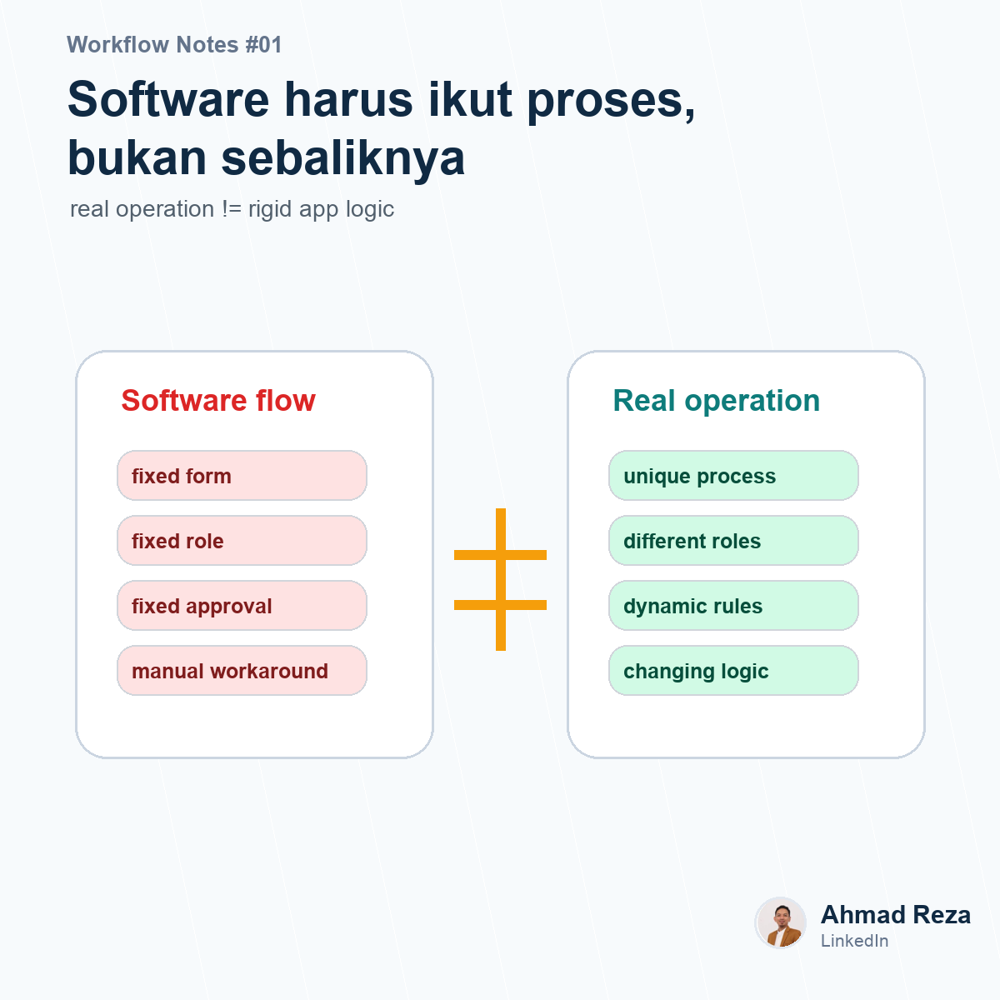

# Post 01 - Software harusnya ikut proses, bukan sebaliknya



## Visual

- Image: `images/post_01.png`
- Image title: Software harus ikut proses, bukan sebaliknya
- Image subtitle: real operation != rigid app logic
- Points: proses unik, approval beda, role beda, logic berubah

## Caption

```text
Kemarin saya kepikiran satu hal waktu lihat beberapa proses operasional di company.

Kadang masalahnya bukan timnya yang nggak disiplin.
Kadang sistemnya aja yang maksa orang kerja dengan cara yang nggak natural.

Contohnya:
1. Approval harus ikut flow bawaan aplikasi.
2. Field di form nggak bisa disesuaikan.
3. Role dan kondisi approval terlalu kaku.
4. Akhirnya tim balik lagi ke WhatsApp atau spreadsheet.

Dampaknya, software yang harusnya bantu kerja malah jadi proses tambahan.

Menurut saya, aplikasi operasional yang ideal itu harus bisa mengikuti cara kerja perusahaan.
Bukan perusahaan yang dipaksa mengikuti logika aplikasi.

Karena setiap company punya proses, approval, dokumen, role, dan pengecualian yang beda-beda.

Kalau di tempat teman-teman, pernah nggak ketemu software yang rapi secara fitur, tapi nggak fit sama real process di lapangan?

#operationalexcellence #businessprocess #workflowautomation
```
