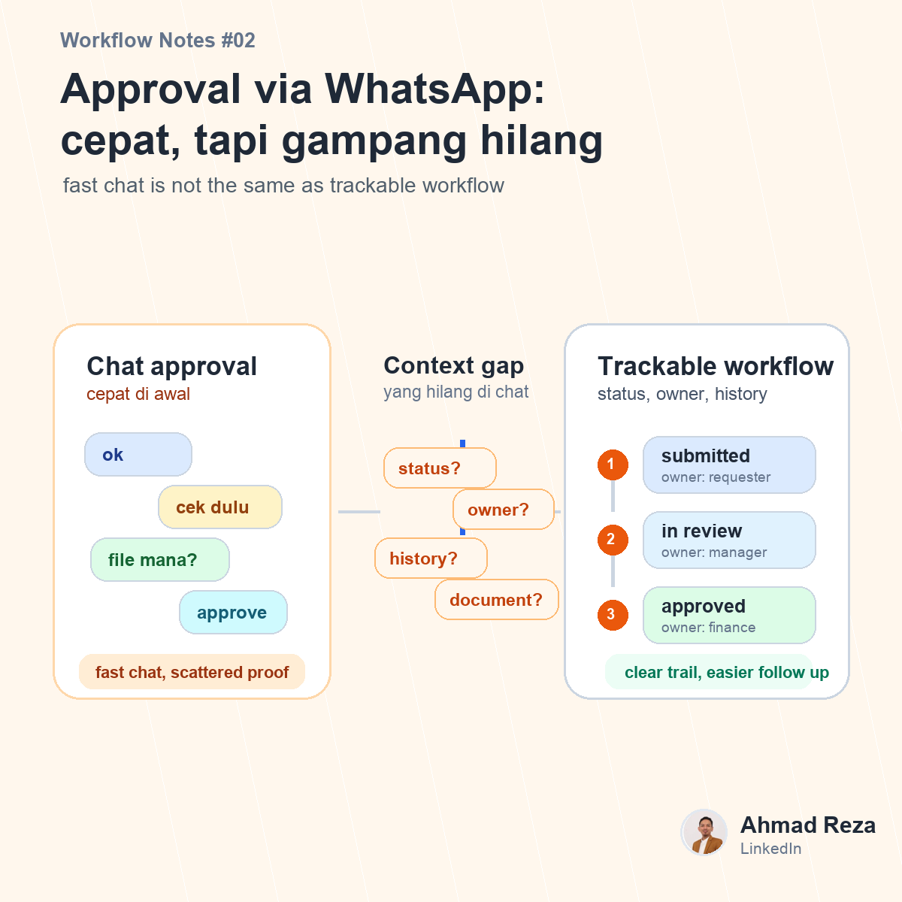

# Post 02 - Approval via WhatsApp itu cepat, sampai harus dicari ulang



## Visual

- Image: `images/post_02.png`
- Image title: Approval via WhatsApp: cepat, tapi gampang hilang
- Image subtitle: fast chat is not the same as trackable workflow
- Points: siapa approve?, status apa?, dokumen mana?, follow up ke siapa?

## Caption

```text
Masih approval lewat WhatsApp?

Awalnya memang cepat.
Tinggal chat atasan, kirim screenshot, tunggu "ok".

Tapi begitu volumenya mulai banyak, problemnya mulai kelihatan:

request ketumpuk di chat
dokumen nyebar
status approval nggak jelas
follow up harus manual
history susah dicari lagi

Ini bukan cuma masalah tools.
Ini masalah visibility.

Approval yang tidak punya status jelas akan bikin tim operasional kerja dengan asumsi.
"Kayanya udah approve."
"Kayanya masih nunggu finance."
"Kayanya dokumennya ada di grup sebelah."

Dan kata "kayanya" ini mahal kalau sudah masuk ke proses bisnis.

Menurut teman-teman, approval yang ideal itu cukup cepat aja?
Atau harus trackable juga dari awal sampai selesai?

#businessprocess #operationalexcellence #approvalworkflow
```
