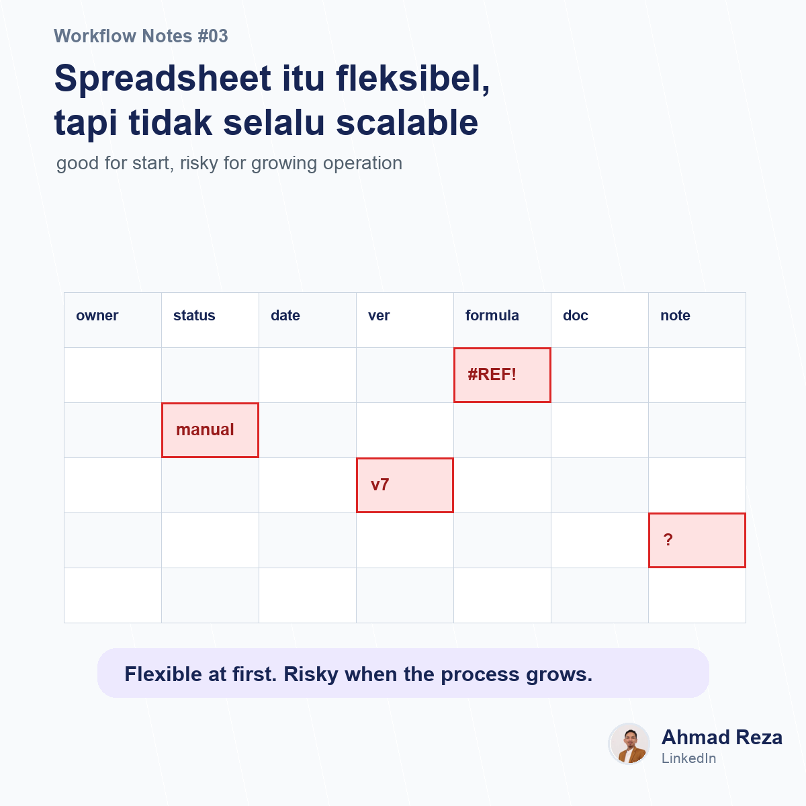

# Post 03 - Spreadsheet fleksibel, tapi tidak selalu scalable



## Visual

- Image: `images/post_03.png`
- Image title: Spreadsheet itu fleksibel, tapi tidak selalu scalable
- Image subtitle: good for start, risky for growing operation
- Points: manual update, version beda, formula rusak, ownership kabur

## Caption

```text
Spreadsheet itu salah satu tools paling underrated di operations.

Saya suka spreadsheet karena fleksibel.
Bisa bikin tracker cepat, form sederhana, report manual, bahkan mini dashboard.

Tapi ada fase dimana spreadsheet mulai jadi beban:

1. Terlalu banyak sheet
2. Terlalu banyak versi file
3. Formula rentan rusak
4. Data entry manual
5. Status pekerjaan tidak otomatis berubah
6. Ownership antar tim mulai kabur

Di fase awal, spreadsheet membantu tim bergerak cepat.
Di fase berikutnya, spreadsheet bisa bikin proses jadi sulit dikontrol.

Menurut saya, spreadsheet itu bagus untuk eksplorasi proses.
Tapi kalau workflow-nya sudah repetitif, punya approval, dan dipakai banyak role, mungkin sudah waktunya dipikirkan ulang.

Bukan berarti langsung ganti semua.
Mulai dari satu proses yang paling sering bikin follow up manual.

Kalau di tempat teman-teman, spreadsheet paling "berat" biasanya dipakai untuk proses apa?

#workflowautomation #businessprocess #operations
```
