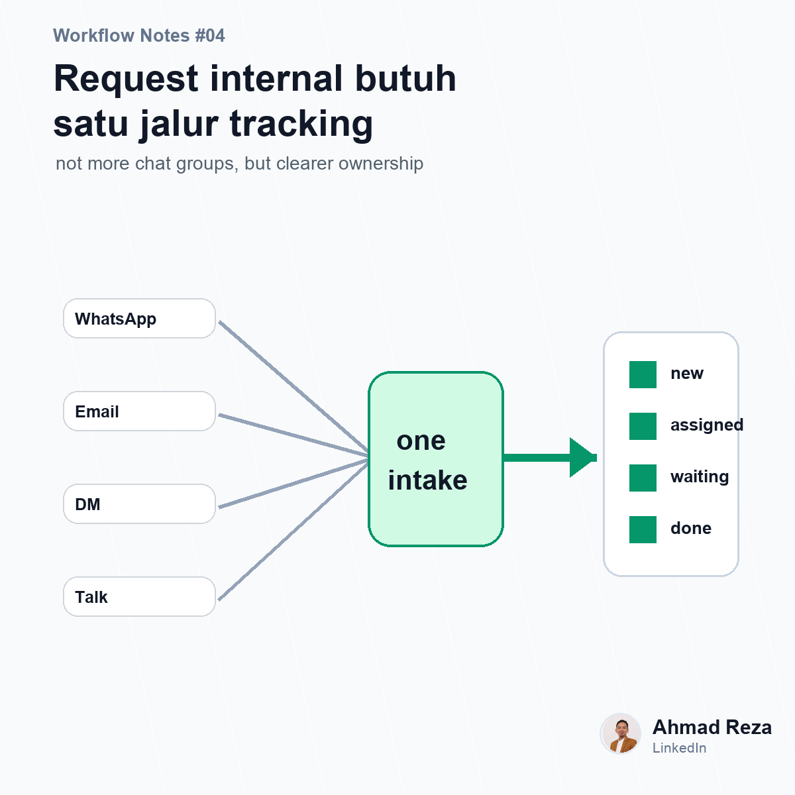

# Post 04 - Request internal sering gagal bukan karena orangnya lambat



## Visual

- Image: `images/post_04.png`
- Image title: Request internal butuh satu jalur tracking
- Image subtitle: not more chat groups, but clearer ownership
- Points: IT request, HR request, GA request, asset request

## Caption

```text
Request internal itu kelihatannya sederhana.

"Minta laptop baru."
"Tolong buatkan akses."
"Ada kerusakan di outlet."
"Butuh approval reimbursement."

Tapi kalau semua request masuk lewat WhatsApp, email, chat pribadi, dan omongan langsung, lama-lama prosesnya jadi susah dikontrol.

Masalahnya bukan selalu karena tim lambat.
Seringnya karena request-nya tidak punya rumah.

Tidak ada satu tempat untuk lihat:

request apa saja yang masuk
siapa PIC-nya
statusnya dimana
SLA-nya lewat atau belum
dokumen pendukungnya lengkap atau tidak

Dampaknya, yang rajin follow up lebih cepat diproses.
Yang diam, request-nya tenggelam.

Menurut saya, internal request yang baik bukan cuma soal form.
Tapi soal ownership dan status yang jelas.

Di company teman-teman, request internal paling sering nyangkut di bagian mana?

#operations #workflow #businessprocess
```
