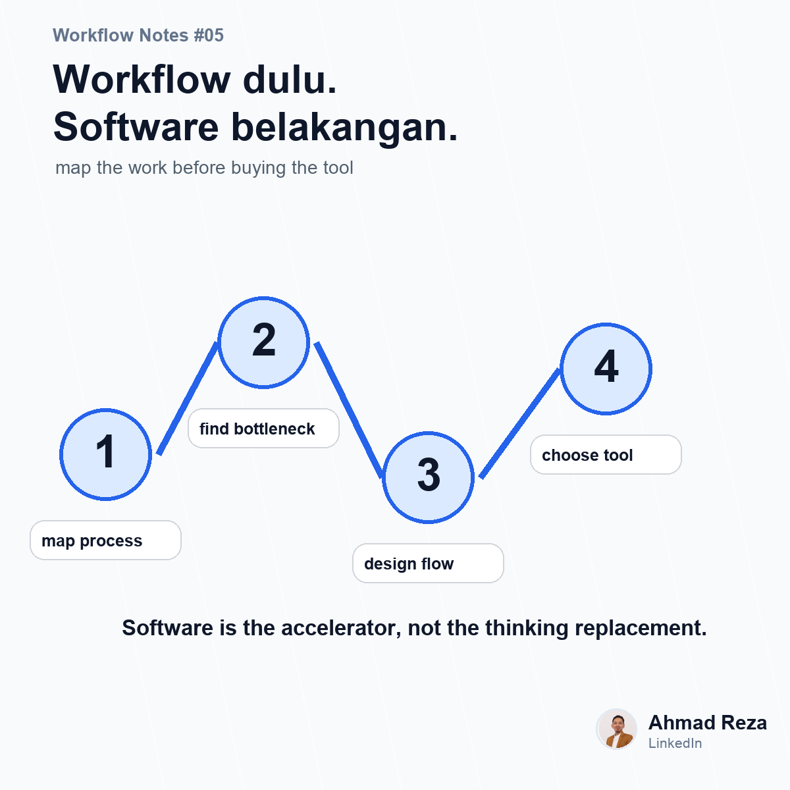

# Post 05 - Workflow dulu, software belakangan



## Visual

- Image: `images/post_05.png`
- Image title: Workflow dulu. Software belakangan.
- Image subtitle: map the work before buying the tool
- Points: map proses, cari bottleneck, design flow, baru digitize

## Caption

```text
Sebelum beli software, mapping dulu proses kerjanya.

Ini lesson yang menurut saya sering kelewat.

Banyak tim langsung lompat ke pertanyaan:
"Tools apa yang bagus?"
"Aplikasi apa yang fiturnya lengkap?"
"Sistem mana yang paling murah?"

Padahal pertanyaan awalnya harusnya:

prosesnya jalan seperti apa sekarang?
bottleneck-nya dimana?
approval-nya siapa saja?
data apa yang harus dikumpulkan?
status apa yang perlu dimonitor?
pengecualian prosesnya apa saja?

Kalau prosesnya belum jelas, software sebagus apapun bisa terasa salah.

Karena software bukan pengganti proses berpikir.
Software cuma mempercepat proses yang sudah didesain dengan cukup jelas.

Menurut teman-teman, sebelum digitalisasi workflow, bagian paling sulit itu mapping prosesnya atau ngajak tim berubah cara kerja?

#operationalexcellence #workflowautomation #processimprovement
```
