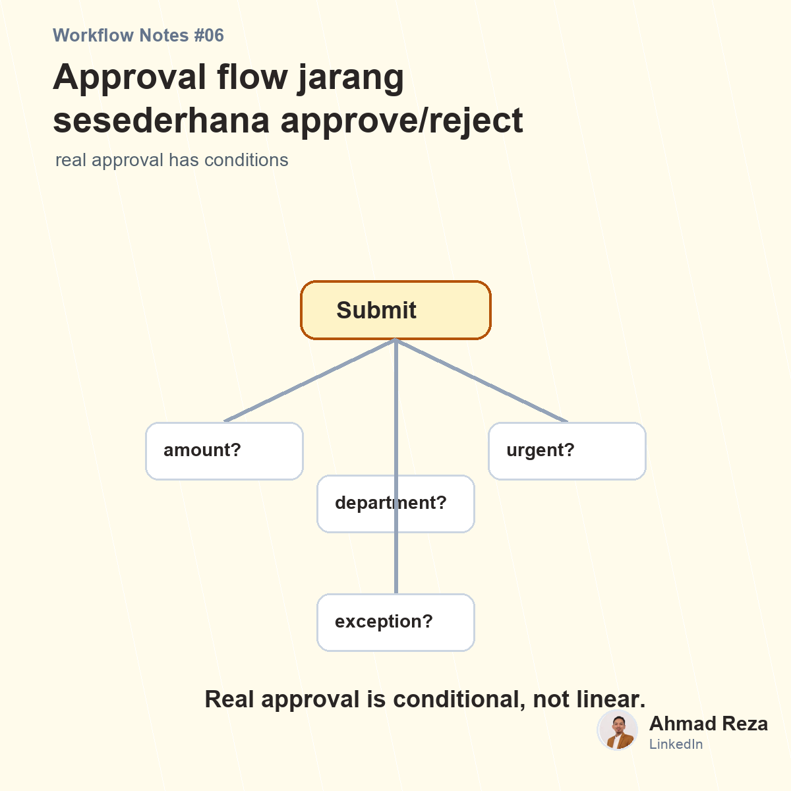

# Post 06 - Approval flow jarang sesederhana Approve atau Reject



## Visual

- Image: `images/post_06.png`
- Image title: Approval flow jarang sesederhana approve/reject
- Image subtitle: real approval has conditions
- Points: amount, department, role, exception

## Caption

```text
Approval flow itu jarang sesederhana:

Submit -> Approve -> Done.

Di real operation, biasanya ada kondisi:

1. Kalau nominal di bawah sekian, cukup manager.
2. Kalau di atas sekian, harus finance.
3. Kalau budget belum tersedia, balik ke requester.
4. Kalau dokumen kurang, request pending.
5. Kalau urgent, perlu escalation.
6. Kalau beda department, beda approver.

Nah, di sini masalahnya.

Banyak software punya approval flow, tapi logikanya terlalu kaku.
Begitu ada kondisi bisnis yang sedikit berbeda, tim mulai bikin workaround.

Dan workaround ini biasanya bentuknya:
spreadsheet tambahan, chat tambahan, approval manual tambahan.

Dampaknya, flow digitalnya ada, tapi proses real-nya tetap manual di belakang layar.

Menurut teman-teman, approval system yang bagus itu harus simple atau harus fleksibel mengikuti kondisi bisnis?

#approvalworkflow #businessprocess #operationalexcellence
```
