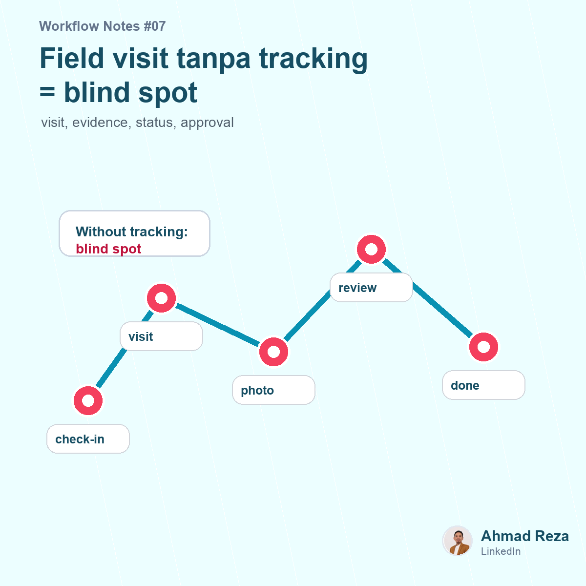

# Post 07 - Field visit tanpa tracking itu blind spot



## Visual

- Image: `images/post_07.png`
- Image title: Field visit tanpa tracking = blind spot
- Image subtitle: visit, evidence, status, approval
- Points: check-in, checklist, photo report, supervisor review

## Caption

```text
Field operation punya tantangan yang beda dari office process.

Kalau proses di kantor masih bisa ditanya langsung, proses di lapangan sering bergantung pada update manual.

"Sudah visit belum?"
"Foto report-nya mana?"
"Checklist-nya lengkap nggak?"
"Supervisor sudah review?"

Kalau semua update masih lewat chat, visibility-nya cepat hilang.

Yang dibutuhkan bukan cuma laporan setelah pekerjaan selesai.
Tapi workflow yang bisa menunjukkan:

siapa yang visit
kapan check-in
checklist apa yang diisi
evidence apa yang dikirim
status task sekarang dimana
siapa yang harus review

Tanpa tracking yang jelas, field operation jadi banyak blind spot.

Dan blind spot ini biasanya baru kelihatan saat ada komplain, audit, atau pekerjaan yang missed.

Kalau teman-teman handle tim lapangan, bagian paling sulit itu tracking visit, validasi report, atau follow up action?

#fieldoperations #workflow #operations
```
