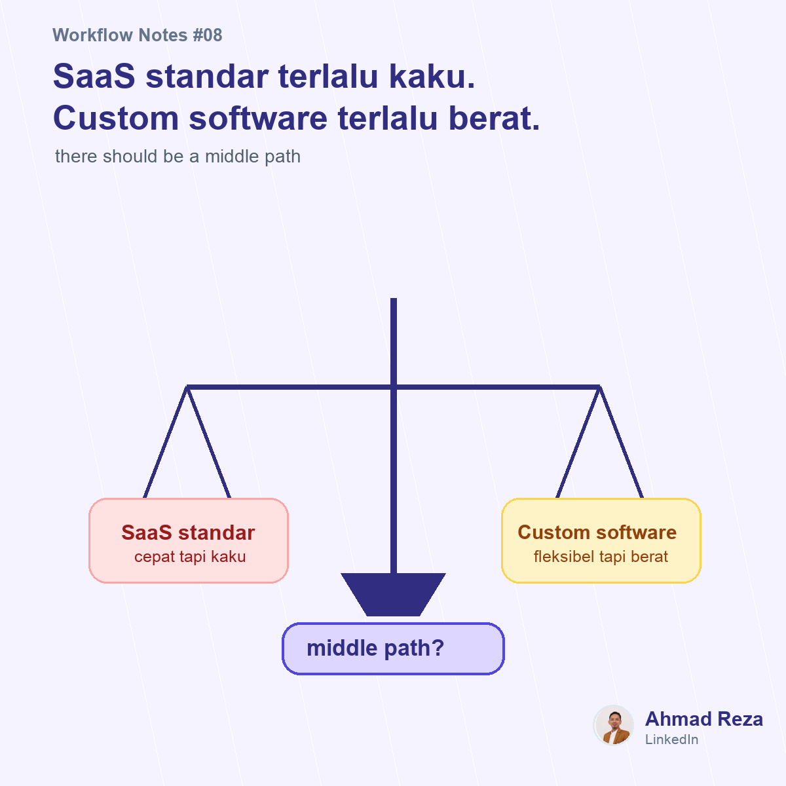

# Post 08 - Custom software bukan satu-satunya jalan



## Visual

- Image: `images/post_08.png`
- Image title: SaaS standar terlalu kaku. Custom software terlalu berat.
- Image subtitle: there should be a middle path
- Points: lebih fleksibel, lebih cepat, lebih ringan, lebih dekat ke proses

## Caption

```text
Pernah ada dilema klasik di digitalisasi proses:

Pakai SaaS standar -> cepat, tapi flow-nya sering kaku.
Bikin custom software -> fleksibel, tapi mahal dan lama.

Di tengah-tengah, banyak tim akhirnya bertahan dengan spreadsheet + WhatsApp karena terasa paling fleksibel.

Padahal masalahnya bukan company nggak mau digital.
Seringnya mereka belum nemu format yang pas:

cukup fleksibel untuk proses unik
cukup terstruktur untuk tracking
cukup cepat untuk diimplementasikan
cukup ringan untuk department-level workflow

Menurut saya, banyak proses operasional sebenarnya tidak butuh ERP besar.
Tapi juga sudah terlalu kompleks untuk spreadsheet.

Yang dibutuhkan adalah middle path antara custom software dan tools manual.

Teman-teman pernah ngalamin dilema build vs buy untuk proses internal?
Biasanya akhirnya pilih yang mana?

#workflowautomation #digitaltransformation #operations
```
