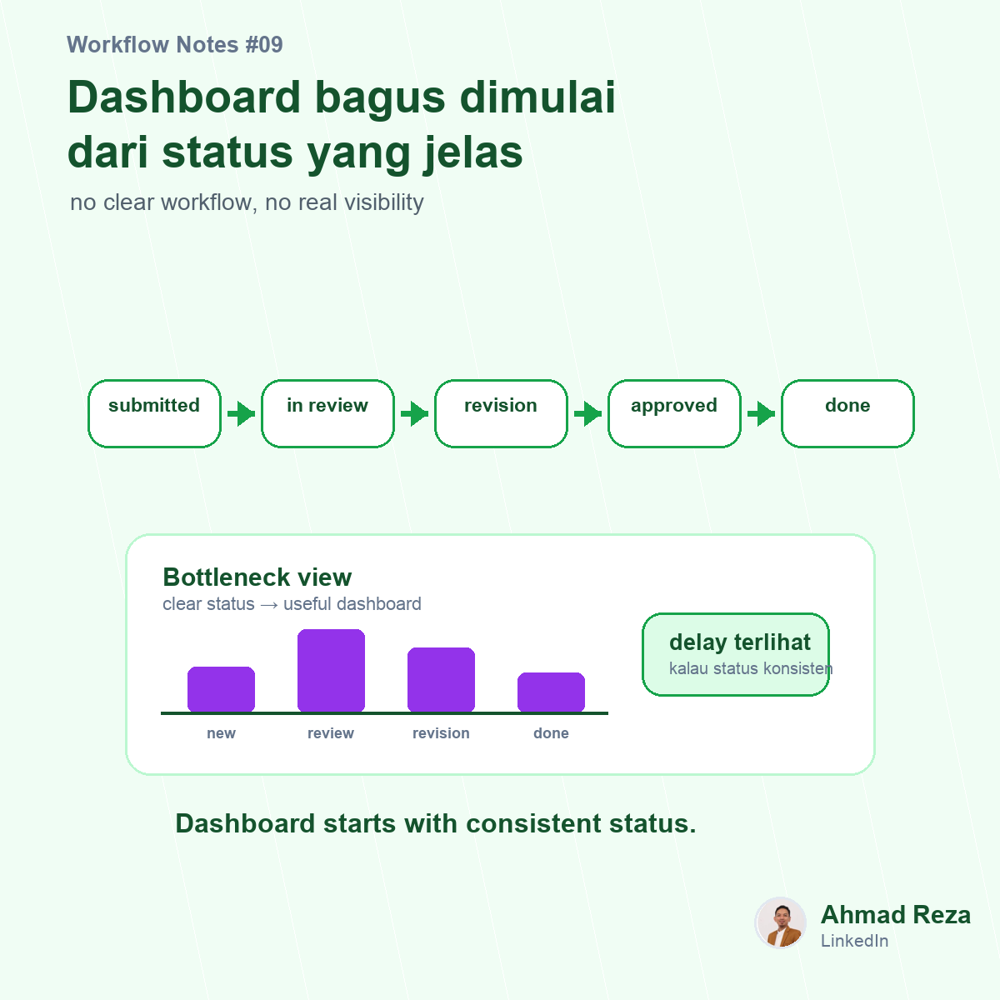

# Post 09 - Visibility real-time dimulai dari status yang jelas



## Visual

- Image: `images/post_09.png`
- Image title: Dashboard bagus dimulai dari status yang jelas
- Image subtitle: no clear workflow, no real visibility
- Points: submitted, in review, need revision, approved

## Caption

```text
Manajemen sering minta dashboard.

Tapi sebelum dashboard, ada hal yang lebih basic:
status prosesnya harus jelas.

Kalau status pekerjaan masih berbentuk chat seperti:
"lagi dicek"
"nanti di-follow up"
"masih tunggu approval"
"kayanya sudah selesai"

maka dashboard-nya juga akan susah dipercaya.

Visibility real-time bukan dimulai dari chart.
Visibility dimulai dari workflow status yang konsisten.

Contoh status sederhana:

1. Submitted
2. In Review
3. Need Revision
4. Approved
5. Done

Begitu status jelas, baru kita bisa lihat bottleneck:

paling lama stuck dimana
approver mana yang sering delay
request mana yang bolak-balik revisi
SLA mana yang sering lewat

Menurut teman-teman, dashboard yang bagus itu lebih banyak soal visualisasi data atau kedisiplinan proses di belakangnya?

#businessprocess #operationsdashboard #operationalexcellence
```
