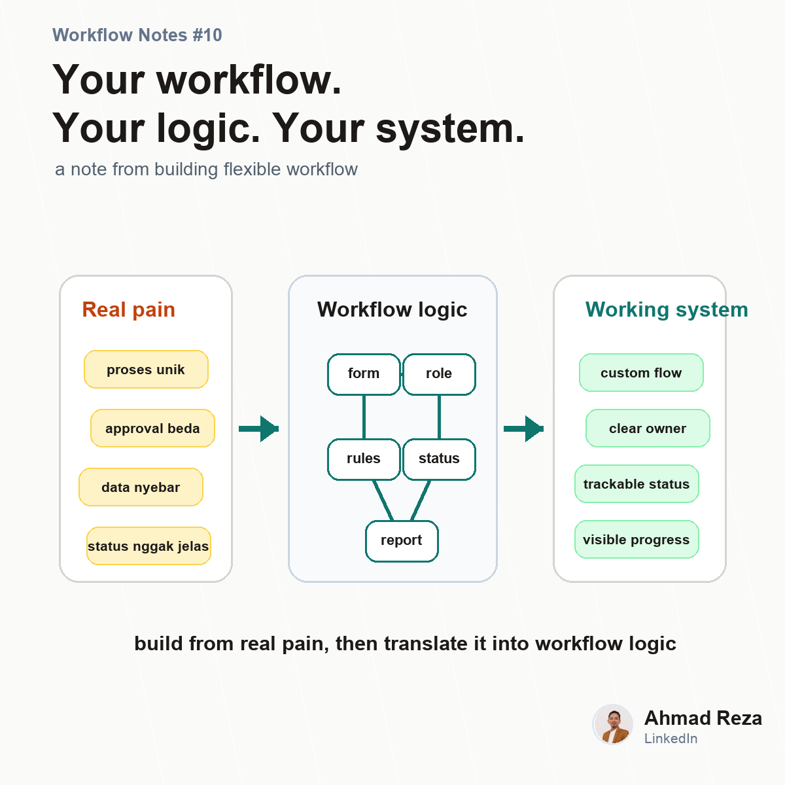

# Post 10 - Ini alasan saya tertarik bangun workflow yang fleksibel



## Visual

- Image: `images/post_10.png`
- Image title: Your workflow. Your logic. Your system.
- Image subtitle: a note from building flexible workflow
- Points: custom flow, approval logic, request tracking, visibility

## Caption

```text
Ini salah satu alasan saya tertarik banget sama flexible workflow.

Karena makin banyak saya lihat proses operasional, makin kerasa bahwa problem-nya jarang cuma "butuh aplikasi".

Problem-nya lebih sering:

1. prosesnya unik
2. approval-nya beda-beda
3. role-nya banyak
4. data masih nyebar
5. status pekerjaan nggak keliatan
6. tools yang ada terlalu kaku atau terlalu berat

Di sisi lain, bikin custom software dari nol juga bukan keputusan ringan.
Mahal, lama, dan butuh maintenance.

Jadi saya lagi explore satu pendekatan:

bagaimana kalau perusahaan bisa punya workflow system yang mengikuti cara kerja mereka?

Bukan sebaliknya.

Ini juga yang jadi dasar dari AnyFlo.id:
Your workflow, your logic, your system.

Belum mau hard selling dulu.
Saya lebih pengen banyak ngobrol soal pain point proses yang real di lapangan.

Kalau teman-teman boleh pilih satu proses untuk dibenerin dulu, proses apa yang paling urgent di company teman-teman?

#workflowautomation #operationalexcellence #buildinpublic
```
