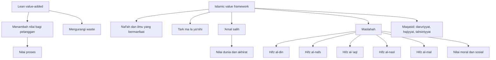

# Aktivitas Bernilai Tambah dalam Perspektif Islam

## Ringkasan Eksekutif

Dalam lean, *value-added activity* adalah aktivitas yang benar-benar menambah nilai dari sudut pandang pelanggan: aktivitas itu berkontribusi langsung pada kebutuhan pelanggan, pelanggan bersedia “membayar” untuknya, dan lean berusaha mengurangi langkah yang tidak menciptakan nilai atau merupakan pemborosan. Islam tidak memakai istilah teknis yang sama, tetapi mempunyai gugus konsep yang sangat dekat: **naf‘** atau manfaat, **ترك ما لا يعنيه** atau meninggalkan hal yang tidak relevan/berfaedah, **‘amal ṣāliḥ** atau amal saleh, **maṣlaḥah** atau kemaslahatan, dan **maqāṣid al-sharī‘ah** atau tujuan-tujuan syariat. Karena itu, “aktivitas bernilai tambah” dalam bacaan Islam paling dekat dipahami sebagai aktivitas yang menghasilkan manfaat yang sah, menjaga tujuan syariat, menghindari *laghw* atau kesia-siaan, dan berdampak baik bagi manusia di dunia sekaligus akhirat. citeturn0search1turn0search4turn25search0turn25search15turn27search4turn4search0turn4search1turn32search5turn33view0turn34view0

Teks-teks klasik menunjukkan bahwa pembahasan ini tersebar di beberapa lapisan. Al-Qur’an memuji orang beriman yang berpaling dari *laghw* dan menegaskan bahwa manusia memperoleh apa yang diusahakannya. Hadis sahih menekankan dua tolok ukur yang sangat dekat dengan gagasan “aktivitas tak terbuang”: meninggalkan hal yang tidak penting dan mengejar **ilmu yang bermanfaat**. Dalam usul fikih, al-Ghazālī mendefinisikan *maṣlaḥah* sebagai penjagaan tujuan syariat dan merumuskannya ke dalam lima perlindungan pokok. Al-Shāṭibī lalu menstrukturkan maslahat ke dalam tingkat *ḍarūriyyāt, ḥājiyyāt,* dan *taḥsīniyyāt*, sambil menekankan bahwa maslahat duniawi itu diukur dari perannya dalam menegakkan kehidupan untuk akhirat, bukan dari hawa nafsu. Ibn Taymiyyah dan Ibn al-Qayyim memperluas implikasi praktisnya: memilih yang paling maslahat, yang paling cocok, yang paling sedikit mudaratnya, dan menilai syariat sebagai kerangka keadilan, rahmat, hikmah, dan maslahat. Al-Rāzī menafsirkan penghindaran *laghw* sebagai penggabungan dua sisi taklif: melakukan yang perlu dan meninggalkan yang sia-sia. citeturn27search4turn41search4turn4search0turn4search1turn32search5turn33view0turn34view0turn39view0turn38view0turn31view0turn18search0

Secara praktis, ini berarti organisasi modern yang ingin memadukan lean dengan etika Islam tidak cukup hanya bertanya, “Apakah pelanggan mau membayar?” Mereka juga harus bertanya, “Apakah aktivitas ini halal, adil, jujur, amanah, tidak merusak, dan sungguh memberi manfaat yang diakui syariat?” Di sinilah perbedaan utama lean dan kerangka Islam: lean terutama berporos pada nilai proses dan pelanggan, sedangkan Islam menambahkan saringan normatif ilahi, dimensi niat, tanggung jawab moral, dan orientasi akhirat. Aktivitas yang menguntungkan pasar bisa saja tetap tidak bernilai menurut Islam jika mengandung penipuan, mudarat, eksploitasi, atau mendorong sesuatu yang haram. Sebaliknya, aktivitas yang tampak “tidak menghasilkan” secara finansial—seperti pendidikan, amanah administrasi, pencegahan bahaya, atau pembinaan akhlak—dapat sangat tinggi nilainya dalam Islam karena ia menjaga tujuan-tujuan syariat dan menciptakan manfaat yang lebih luas. citeturn25search15turn25search21turn32search5turn34view0turn39view0turn38view0turn4search1turn27search11

## Kerangka Konsep

Secara analitis, paralel antara lean dan Islam paling baik dipahami sebagai **analogi normatif**, bukan identitas terminologis. Lean memulai dari “nilai” menurut pelanggan dan menilai alur proses menurut kontribusinya terhadap kebutuhan pelanggan, lalu berusaha menghilangkan *waste*. Dalam Islam, titik tolaknya adalah “nilai” menurut wahyu dan maslahat yang sah: manfaat tidak diukur semata oleh kemauan pasar, tetapi oleh kesesuaiannya dengan tujuan syariat, kebenaran, keadilan, dan manfaat riil bagi manusia. Karena itu, *value-added* dalam Islam lebih dekat kepada **manfaat yang dibenarkan** daripada sekadar **nilai jual**. citeturn0search1turn0search4turn25search0turn25search15turn32search5turn34view0turn38view0

Konsep-konsep Islam yang paling relevan ialah sebagai berikut. **Naf‘/manfaat** tampak sangat jelas dalam hadis tentang *“ilmu yang bermanfaat”*; ukuran pentingnya bukan sekadar memiliki pengetahuan, tetapi apakah pengetahuan itu benar-benar memberi faedah. **Tark mā lā ya‘nīh** atau meninggalkan apa yang tidak relevan mendekati gagasan eliminasi aktivitas sia-sia. **‘Amal ṣāliḥ** memperluas makna “aktivitas bernilai” dari sekadar efisien menjadi lurus, bermanfaat, benar, dan sabar. **Maṣlaḥah** memberi kerangka substantif: aktivitas dinilai baik jika menjaga agama, jiwa, akal, keturunan, dan harta. **Maqāṣid al-sharī‘ah** memberi hierarki prioritas: mana yang darurat, mana yang memudahkan, dan mana yang menyempurnakan. Dengan kata lain, Islam menggabungkan dimensi **hasil**, **cara**, **niat**, dan **dampak luas**. citeturn4search1turn4search0turn27search6turn41search4turn32search5turn33view0turn34view0

Tabel berikut merangkum paralel utamanya.

| Konsep | Rumusan ringkas | Sumber klasik utama | Hubungan dengan *value-added* |
|---|---|---|---|
| **Laghw** | Aktivitas/kata yang sia-sia, tidak patut diikuti | Q. 23:3; tafsir al-Rāzī pada ayat ini. citeturn27search4turn31view0 | Paling dekat dengan kategori aktivitas yang harus dipangkas karena tidak memberi manfaat riil. citeturn25search15turn31view0 |
| **Tark mā lā ya‘nīh** | Meninggalkan yang tidak relevan bagi agama dan kemaslahatan hidup | Hadis Tirmiżī/Ibn Mājah, dinilai sahih dalam penilaian al-Albānī; juga dikembangkan Ibn al-Qayyim sebagai inti *wara‘*. citeturn4search0turn30search5 | Mirip disiplin lean dalam menolak aktivitas “sibuk tapi tak menambah nilai”. citeturn25search15turn4search0 |
| **‘Ilm yun­tafa‘u bih** | Ilmu bernilai bila memberi manfaat berkelanjutan | Hadis Muslim tentang *ilmu yang dimanfaatkan*. citeturn4search1turn3search17 | Menekankan bahwa output pengetahuan harus membuahkan manfaat, bukan sekadar informasi. citeturn4search1 |
| **‘Amal ṣāliḥ** | Amal yang benar, baik, dan menyelamatkan dari kerugian | Q. al-‘Aṣr 103:1–3; Q. 53:39. citeturn27search6turn41search4 | Bukan hanya efisien, tetapi juga benar secara moral dan produktif dalam makna luas. citeturn27search6turn41search4 |
| **Maṣlaḥah** | Menjaga tujuan syariat, bukan sekadar manfaat subjektif | al-Ghazālī, *al-Mustaṣfā*: menjaga agama, jiwa, akal, keturunan, harta. citeturn32search5turn32search3 | Memberi isi substantif terhadap “nilai”: sesuatu bernilai bila menjaga lima pokok ini. citeturn32search5 |
| **Maqāṣid** | Prioritas maslahat: darurat, kebutuhan, penyempurna | al-Shāṭibī, *al-Muwāfaqāt*. citeturn33view0 | Membantu memilah prioritas kerja, kebijakan, dan alokasi sumber daya. citeturn33view0turn34view0 |
| **Tarjīḥ al-aṣlaḥ** | Memilih yang lebih maslahat dan lebih sedikit mudarat | Ibn Taymiyyah: “melakukan خير الخيرين dan menolak شر الشرين”. citeturn39view0turn12view0 | Relevan untuk keputusan manajerial saat semua opsi tidak ideal. citeturn39view0turn12view0 |
| **Syariat sebagai keadilan-rahmat-maslahat** | Hukum dinilai dari keluasan maslahat dan hikmah | Ibn al-Qayyim, *I‘lām al-Muwaqqi‘īn*. citeturn38view0 | Menjaga agar efisiensi tidak berubah menjadi kedzaliman atau absurditas. citeturn38view0 |

Secara historiografis, para sarjana modern mencatat bahwa diskursus *maṣlaḥah* bertumbuh dari prinsip yang relatif terbatas dalam usul fikih menjadi kerangka tujuan hukum yang jauh lebih menyeluruh, terutama menuju al-Shāṭibī. Bacaan modern yang paling sering dipakai untuk memetakan perkembangan ini adalah Felicitas Opwis dan Wael Hallaq. Keterangan ini penting karena ia menjelaskan mengapa paralel dengan “value-added” lebih kuat bila dibaca melalui jalur *maqāṣid* daripada dicari sebagai istilah literal dalam teks klasik. citeturn26search0turn26search7turn26search1turn26search15

## Sumber Primer Klasik

**Al-Ghazālī** memberi formulasi paling mendasar untuk membaca “aktivitas bermanfaat” dalam kerangka hukum Islam. Dalam *al-Mustaṣfā*, ia menolak menyamakan maslahat dengan sekadar perolehan manfaat menurut keinginan manusia. Rumusnya terkenal: maslahat adalah penjagaan tujuan syariat, dan tujuan syariat terhadap manusia ada lima—agama, jiwa, akal, keturunan, dan harta. Dalam kutipan yang lazim dirujuk, lokasi ini muncul sekitar *al-Mustaṣfā* 1:286–287 pada sebagian edisi, sementara pada edisi lain diringkas sebagai 1:140; variasi ini berasal dari perbedaan cetakan dan penomoran. Bagi riset organisasi, ini berarti aktivitas tidak dinilai hanya dari produktivitas kasat mata, tetapi dari apakah ia menjaga lima kepentingan tersebut. citeturn32search5turn32search3turn32search2turn21view0turn1search9

**Al-Shāṭibī** menyusun tahap berikutnya. Dalam *al-Muwāfaqāt*, *Kitāb al-Maqāṣid*, ia menulis bahwa taklif syariat kembali kepada penjagaan tujuan-tujuannya dalam makhluk, dan tujuan itu terdiri dari *ḍarūriyyāt, ḥājiyyāt,* dan *taḥsīniyyāt*. Ini memberi kerangka prioritas yang sangat berguna bagi organisasi: ada aktivitas yang bersifat pokok dan tidak boleh dikorbankan, ada yang berfungsi menghilangkan kesempitan, dan ada yang menyempurnakan kualitas. Dalam penjelasan yang dikutip Ahmad al-Raysuni dari *al-Muwāfaqāt*, al-Shāṭibī juga menekankan bahwa maslahat duniawi dinilai dari perannya dalam menopang kehidupan untuk akhirat, bukan dari hawa nafsu jangka pendek. Jadi, efisiensi bukan tujuan final; ia harus tersusun di bawah horizon teleologis yang lebih besar. citeturn33view0turn34view0turn1search2

**Fakhr al-Dīn al-Rāzī** membahas tema ini terutama melalui tafsir. Pada Q. al-Mu’minūn 23:3, ia menafsirkan pujian terhadap orang beriman yang berpaling dari *laghw* dan menutup pembahasannya dengan pernyataan yang sangat relevan: Allah menyifati mereka dengan khusyuk dalam shalat lalu dengan berpaling dari *laghw* “agar menghimpun bagi mereka sisi melakukan dan meninggalkan yang sama-sama berat bagi jiwa”. Ini penting secara konseptual: nilai bukan hanya dihasilkan oleh “mengerjakan sesuatu”, tetapi juga oleh **menahan diri dari aktivitas yang tidak perlu, tidak bermakna, atau berlawanan dengan tujuan hidup**. Dalam penafsiran Surah al-‘Aṣr yang kemudian dikutip dalam karya-karya tafsir lain, al-Rāzī juga menekankan tingginya nilai waktu dan kerugian besar bila umur dihabiskan pada hal yang “tidak berarti”. citeturn31view0turn18search0

**Ibn Taymiyyah** mengalihkan pembahasan ke ranah keputusan sosial dan organisasi. Dalam *al-Ḥisbah* dan kutipan-kutipan kebijakan yang dirujuk pada *al-Siyāsah al-Shar‘iyyah* serta *Majmū‘ al-Fatāwā*, ia menegaskan bahwa ketika tidak ada pilihan sempurna, kewajiban adalah memilih yang terbaik dari yang tersedia, melakukan “yang lebih baik dari dua kebaikan” dan menolak “yang lebih buruk dari dua keburukan”. Ia juga menekankan pemilihan orang yang “lebih bermanfaat” bagi suatu jabatan, dengan mempertimbangkan kekuatan dan amanah. Secara manajerial, ini sangat dekat dengan pemikiran prioritisasi, *trade-off*, dan penempatan SDM berbasis kemanfaatan nyata, tetapi tetap diikat oleh amanah dan moralitas. citeturn39view0turn12view0

**Ibn al-Qayyim** memberi bahasa normatif yang lebih eksplisit. Dalam *I‘lām al-Muwaqqi‘īn*, ia menyatakan bahwa syariat dibangun di atas hikmah dan kemaslahatan hamba, lalu menegaskan bahwa setiap masalah yang beralih dari keadilan ke kezaliman, dari rahmat ke kebalikannya, dari maslahat ke mafsadat, dan dari hikmah ke absurditas, bukan bagian dari syariat meski dipaksakan lewat takwil. Dalam *al-Fawā’id*, ia menambahkan sisi tazkiyah yang penting untuk etika kerja: keuntungan terbesar di dunia ialah menyibukkan diri pada setiap waktu dengan apa yang paling utama dan paling bermanfaat bagi akhirat; ilmu tanpa amal tidak bermanfaat; dan tingkat takwa tertinggi mencakup meninggalkan hal-hal berlebih dan yang tidak penting. Kombinasi dua karya ini melahirkan etika organisasi yang menuntut efektivitas sekaligus integritas. citeturn38view0turn37view0

## Kutipan Arab Kunci

Berikut kutipan-kutipan pendek yang paling relevan, dipilih secukupnya agar tetap dekat dengan teks primer dan mudah dipakai sebagai jangkar konseptual.

> **وَٱلَّذِينَ هُمْ عَنِ ٱللَّغْوِ مُعْرِضُونَ**  
Terjemah: “dan orang-orang yang berpaling dari perbuatan dan perkataan yang sia-sia.” Ini memberi dasar Qur’ani paling eksplisit untuk menolak aktivitas yang tidak berguna. citeturn27search4turn27search8

> **مِنْ حُسْنِ إِسْلَامِ الْمَرْءِ تَرْكُهُ مَا لاَ يَعْنِيهِ**  
Terjemah: “Termasuk baiknya Islam seseorang adalah ia meninggalkan apa yang tidak menjadi urusannya.” Ini adalah kaidah profetik yang sangat dekat dengan eliminasi *waste* dalam arti moral dan praktis. citeturn4search0turn4search9

> **أَوْ عِلْمٍ يُنْتَفَعُ بِهِ**  
Terjemah: “atau ilmu yang dimanfaatkan.” Hadis ini menegaskan bahwa nilai ilmu terletak pada kemanfaatannya yang terus mengalir. citeturn4search1turn3search17

> **نَعْنِي بِالْمَصْلَحَةِ الْمُحَافَظَةَ عَلَى مَقْصُودِ الشَّرْعِ**  
Terjemah: “Yang kami maksud dengan maslahat ialah menjaga tujuan syariat.” Inilah definisi kunci al-Ghazālī yang menggeser ukuran dari sekadar manfaat subjektif menuju manfaat yang diakui syariat. citeturn32search5turn32search3

> **تَكَالِيفُ الشَّرِيعَةِ تَرْجِعُ إِلَى حِفْظِ مَقَاصِدِهَا**  
Terjemah: “Taklif syariat kembali kepada penjagaan tujuan-tujuannya.” Rumusan al-Shāṭibī ini memberi kerangka prioritas yang sistematis untuk menilai aktivitas. citeturn33view0

> **فَيَفْعَلُ خَيْرَ الْخَيْرَيْنِ وَيَدْفَعُ شَرَّ الشَّرَّيْنِ**  
Terjemah: “Maka ia melakukan yang lebih baik dari dua kebaikan dan menolak yang lebih buruk dari dua keburukan.” Ini adalah prinsip keputusan ketika semua opsi tidak sempurna. citeturn39view0turn12view0

> **الشَّرِيعَةُ مَبْنَاهَا وَأَسَاسُهَا عَلَى الْحِكَمِ وَمَصَالِحِ الْعِبَادِ**  
Terjemah: “Syariat dibangun dan didasarkan atas hikmah dan kemaslahatan hamba.” Formulasi Ibn al-Qayyim ini penting agar “efisiensi” tidak lepas dari keadilan, rahmat, dan hikmah. citeturn38view0

> **لِيَجْمَعَ لَهُمُ الْفِعْلَ وَالتَّرْكَ**  
Terjemah: “agar Dia menghimpunkan bagi mereka sisi melakukan dan meninggalkan.” Dalam tafsir al-Rāzī, orang beriman bernilai bukan hanya karena melakukan kerja yang benar, tetapi juga karena meninggalkan kesia-siaan. citeturn31view0

Catatan kehati-hatian: hadis **إِنَّ اللهَ يُحِبُّ إِذَا عَمِلَ أَحَدُكُمْ عَمَلًا أَنْ يُتْقِنَهُ** sangat populer untuk etika kerja, dan pada sebagian penilaian dinilai *ḥasan* oleh al-Albānī, tetapi ada juga penilaian yang melemahkannya dari jalur lain. Karena itu, ia baik dipakai sebagai penguat budaya *itqān* atau profesionalisme, tetapi tidak sebaiknya dijadikan fondasi tunggal tanpa dukungan nash yang lebih kuat seperti ayat tentang *laghw*, hadits *mā lā ya‘nīh*, dan *‘ilm yuntafa‘u bih*. citeturn4search2turn4search8turn4search11

## Implikasi untuk Etika Kerja dan Organisasi Modern

Penerapan paling langsung ialah menjadikan **manfaat yang sah** sebagai kriteria desain kerja. Dalam lean, organisasi memetakan aliran nilai lalu memangkas langkah yang tidak memberi nilai. Dalam kerangka Islam, peta itu perlu ditambah pertanyaan normatif: apakah proses ini menjaga jiwa, akal, harta, amanah, dan kejujuran; apakah ia menjauh dari *laghw*; apakah ia menghasilkan pengetahuan atau layanan yang bermanfaat; dan apakah ia mengarahkan manusia pada kerja yang saleh, bukan sekadar kerja yang laku dijual. Ini mendorong audit proses yang tidak hanya mengukur biaya dan waktu, tetapi juga moral hazard, manipulasi, pemborosan sosial, dan kualitas dampak. citeturn25search0turn25search15turn32search5turn33view0turn27search11turn4search1

Pada level kepemimpinan, teks Ibn Taymiyyah sangat relevan bagi penempatan orang dan pengambilan keputusan. Jabatan tidak otomatis diberikan kepada “orang paling saleh” bila ia tak sanggup menjalankan tugas, juga tidak kepada “orang paling kuat” bila pengkhianatan dan kezalimannya besar. Prinsipnya adalah memilih yang **paling cocok dan paling bermanfaat** bagi fungsi tersebut, sambil mengurangi mudarat. Untuk organisasi modern, ini berarti rekrutmen dan promosi perlu menggabungkan kompetensi, amanah, dampak, dan risiko—bukan hanya senioritas atau kedekatan personal. citeturn12view0turn39view0

Pada level budaya kerja, hadis *“ilmu yang dimanfaatkan”* dan peringatan Ibn al-Qayyim tentang ilmu tanpa amal menolak organisasi yang hanya menumpuk dokumen, pelatihan, rapat, atau data tanpa penerapan. Pengetahuan hanya “bernilai tambah” bila dapat dipakai untuk perbaikan nyata, pengurangan bahaya, atau peningkatan kualitas keputusan. Karena itu, sistem dokumentasi, SOP, dan pelatihan dalam organisasi Muslim idealnya diukur bukan lewat volume, tetapi lewat jejak manfaat: apakah orang benar-benar menggunakannya, apakah kesalahan berulang berkurang, dan apakah layanan menjadi lebih adil dan lebih aman. citeturn4search1turn37view0

Pada level perilaku sehari-hari, Q. 17:36 dan hadis *mā lā ya‘nīh* mendukung etika kerja yang hemat perhatian: tidak mengejar kabar yang tak valid, tidak memperbesar gosip kantor, tidak menyibukkan diri dengan hal yang berada di luar kebutuhan tugas, dan tidak membuat keputusan tanpa dasar pengetahuan. Dalam bahasa lean, ini mendekati pengurangan *waste* berupa menunggu, koreksi ulang, komunikasi bising, dan keputusan cacat. Dalam bahasa Islam, ia sekaligus merupakan penjagaan terhadap akal, amanah informasi, dan akhlak lisan. citeturn27search11turn4search0turn25search15

Jika dirumuskan sebagai praktik, organisasi dapat memakai lima pertanyaan saringan. Pertama, **halal**: apakah aktivitas ini sah secara syariat? Kedua, **manfaat**: siapa yang benar-benar diuntungkan? Ketiga, **maqāṣid**: tujuan dasar apa yang dijaga atau dirusak? Keempat, **ketepatan**: apakah aktivitas ini dilakukan dengan mutu yang baik, bukti yang cukup, dan amanah? Kelima, **prioritas**: bila sumber daya terbatas, apakah ini termasuk *ḍarūrī*, *ḥājī*, atau *taḥsīnī*? Rangkaian ini mencegah organisasi terjebak dalam rutinitas yang tampak produktif tetapi sebenarnya kosong, merusak, atau sekadar simbolik. citeturn32search5turn33view0turn39view0turn38view0turn27search11

## Perbedaan dan Keterbatasan antara Lean dan Kerangka Islam

Perbedaan pertama bersifat **epistemik**. Lean mendefinisikan nilai dari sudut pelanggan; Islam mendefinisikan manfaat yang sah dari sudut syariat, yang tentu memperhatikan manusia, tetapi tidak menyerahkan hukum nilai sepenuhnya kepada preferensi konsumen. Karena itu, sesuatu dapat “value-added” dalam pasar namun tetap tertolak secara Islam jika membahayakan, menipu, atau merusak tujuan syariat. Sebaliknya, sesuatu yang tidak langsung berbayar—misalnya verifikasi kebenaran informasi, perlindungan keselamatan, pendidikan akhlak, atau pencegahan riba dan kecurangan—dapat amat bernilai dalam Islam. citeturn0search1turn0search4turn25search15turn32search5turn34view0turn38view0

Perbedaan kedua ialah **cakupan tujuan**. Lean berfokus pada kualitas, biaya, aliran, dan pengurangan pemborosan dalam proses; Islam memasukkan dimensi niat, pahala, dosa, hak Allah, hak manusia, tanggung jawab akhirat, dan implikasi sosial yang lebih luas. Surah al-‘Aṣr, hadis *‘ilm yuntafa‘u bih*, dan rumusan al-Shāṭibī menempatkan kerja dalam horizon yang lebih besar daripada efisiensi operasional. Karena itu, aktivitas ibadah, sedekah, pendidikan, kesabaran, dan saling menasihati bisa menjadi aktivitas “bernilai sangat tinggi” dalam Islam walaupun tidak masuk kategori *value-added* lean dalam arti sempit. citeturn27search6turn4search1turn34view0

Perbedaan ketiga ialah **cara memperlakukan yang tampak tidak produktif secara langsung**. Dalam lean, beberapa langkah mungkin dipertahankan karena kondisi sistem sekarang meski belum mencipta nilai langsung. Dalam kerangka Islam, aktivitas yang tidak menghasilkan output pasar dapat tetap memiliki nilai besar bila ia menjaga amanah, hak, keselamatan, dan keadilan. Misalnya, dokumentasi akuntabel, audit anti-kecurangan, atau pengajaran yang membentuk manusia. Jadi, tidak semua “non-billable” adalah sia-sia; yang dinilai adalah manfaat substantif dan maqāṣid-nya. citeturn25search0turn32search5turn39view0turn38view0

Keterbatasan utama dari analisis ini ialah bahwa **“value-added activity” adalah istilah manajemen modern**, sedangkan teks klasik Islam berbicara dengan bahasa *maṣlaḥah, laghw, naf‘, ‘amal ṣāliḥ,* dan *maqāṣid*. Maka, hubungan di antara keduanya harus dibaca sebagai **paralel konseptual** dan **penerjemahan lintas-disiplin**, bukan sebagai padanan satu-banding-satu. Secara metodologis, pendekatan ini tetap kuat karena tema sentralnya sama: membedakan antara yang sungguh berguna dan yang sia-sia, lalu menyusun prioritas tindakan atas dasar manfaat yang sah. citeturn25search15turn32search5turn33view0turn26search0turn26search1

## Bibliografi Singkat dan Tautan Bacaan Lanjut

Berikut daftar rujukan yang paling berguna untuk penelitian lanjutan. Saya memprioritaskan teks primer digital Arab yang dapat diverifikasi, lalu karya akademik modern yang reputasinya kuat.

**Teks primer klasik**

- **Al-Ghazālī, *al-Mustaṣfā min ‘Ilm al-Uṣūl***. Edisi digital terindeks di Shamela dan salinan pindai di al-Maktabah al-Waqfiyyah. Lihat entri bibliografis dan akses daring di sini: citeturn1search9turn21view0  
- **Al-Shāṭibī, *al-Muwāfaqāt***, terutama *Kitāb al-Maqāṣid*, *al-qism al-awwal*. Akses digital dan metadata cetakan: citeturn1search2turn33view0  
- **Ibn Taymiyyah, *al-Ḥisbah fī al-Islām* / *al-Siyāsah al-Shar‘iyyah* / *Majmū‘ al-Fatāwā***. Untuk keputusan prioritas, kemanfaatan jabatan, dan *trade-off*: citeturn39view0turn1search3turn12view0  
- **Ibn al-Qayyim, *I‘lām al-Muwaqqi‘īn* dan *al-Fawā’id***. Untuk teori maslahat-hikmah dan etika ilmu-amal-fudūl: citeturn14search2turn38view0turn2search5turn37view0  
- **Fakhr al-Dīn al-Rāzī, *Mafātīḥ al-Ghayb***. Untuk tafsir *laghw* dan nilai waktu, gunakan akses yang terindeks berikut: citeturn15search0turn31view0turn18search0  

**Sumber primer dasar Al-Qur’an dan hadis**

- **Q. al-Mu’minūn 23:3**, **Q. al-‘Aṣr 103:1–3**, **Q. al-Najm 53:39**, **Q. al-Isrā’ 17:36**: citeturn27search4turn27search6turn41search4turn27search11  
- **Hadis *mā lā ya‘nīh*** dan **hadis *‘ilm yuntafa‘u bih*** dengan takhrij dan status ringkas: citeturn4search0turn4search1  

**Kajian akademik modern yang sangat membantu**

- **Felicitas Opwis, *Maṣlaḥa and the Purpose of the Law***, Brill. Ini salah satu peta historis terbaik tentang perkembangan *maṣlaḥah* dari masa klasik hingga al-Shāṭibī. citeturn26search0turn26search4turn26search14  
- **Wael B. Hallaq, *A History of Islamic Legal Theories***, Cambridge University Press. Berguna untuk konteks sejarah usul fikih dan posisi *maṣlaḥah/maqāṣid* dalam tradisi Sunni. citeturn26search1turn26search15  
- **Mohammad Hashim Kamali, *Maqāṣid al-Sharī‘ah Made Simple***, IIIT. Pengantar yang jernih dan mudah dibaca untuk pembaca kontemporer. citeturn24search5turn24search8  
- **Jasser Auda, *Maqāṣid al-Sharī‘ah as Philosophy of Islamic Law***, IIIT. Penting bila Anda ingin menghubungkan *maqāṣid* dengan organisasi, sistem, hak, dan pembangunan. citeturn24search2turn24search6turn24search13  

**Rujukan untuk sisi lean**

- **Lean Enterprise Institute**, entri tentang *value*, *value stream mapping*, *Toyota Production System*, dan penjelasan lean sebagai penciptaan nilai dengan lebih sedikit sumber daya dan lebih sedikit pemborosan: citeturn0search4turn25search0turn25search21turn25search15  
- **ASQ**, definisi tentang aktivitas bernilai tambah dan lean sebagai eliminasi aktivitas tak bernilai tambah: citeturn0search1turn25search12  

**Saran urutan membaca**

Mulailah dari Q. 23:3, hadis *mā lā ya‘nīh*, dan hadis *‘ilm yuntafa‘u bih* untuk dasar normatif. Lalu baca al-Ghazālī untuk definisi maslahat, al-Shāṭibī untuk struktur maqāṣid, Ibn Taymiyyah untuk prioritas dan penempatan peran, Ibn al-Qayyim untuk bahasa etis maslahat-keadilan-hikmah, dan al-Rāzī untuk dimensi tafsir tentang *laghw* dan nilai waktu. Setelah itu, gunakan Opwis, Hallaq, Kamali, dan Auda untuk menjembatani diskursus klasik dengan etika organisasi modern. citeturn27search4turn4search0turn4search1turn32search5turn33view0turn39view0turn38view0turn31view0turn26search0turn26search1turn24search5turn24search2