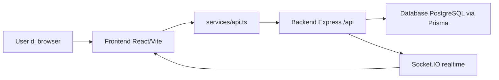

# anyflow.id - Peta Logika Sistem

Vault ini dibuat untuk membaca project anyflow.id dengan bahasa manusia, tanpa harus bisa membaca kode.

Cara membaca yang paling enak:

1. Buka catatan ini dulu.
2. Lanjut ke [[01 - Root Frontend/Ringkasan Frontend]] untuk memahami layar yang dilihat user.
3. Lanjut ke [[02 - Backend Server/Ringkasan Backend]] untuk memahami mesin API di belakang layar.
4. Baca [[03 - Alur Utama/Alur Halaman Workflow Tracker]] karena ini alur paling penting: user membuka tracker, frontend meminta data, backend mengambil data, lalu perubahan dikirim realtime.
5. Pakai [[04 - Kamus API dan Data/Kamus API Utama]] sebagai kamus endpoint API.

## Gambaran sangat besar

Project ini terdiri dari dua dunia besar:

- **Root / frontend**: aplikasi React yang berjalan di browser. User melihat dashboard, tracker, form, workflow builder, master data, laporan, login, dan lain-lain dari sini.
- **server / backend**: aplikasi Express yang menyediakan API. Backend menerima request dari frontend, membaca/menulis database lewat Prisma, menjalankan automation, SLA worker, report worker, upload/storage, dan realtime Socket.IO.

Kalau digambarkan sederhana:

## Bahasa sederhana komponen sistem

- **Workflow**: template proses. Berisi status, field/form, aturan transisi, konfigurasi tracker, permission, SLA, dan automation.
- **Ticket**: satu item pekerjaan/data di dalam workflow. Misalnya satu pengajuan, satu kasus, satu task, atau satu record operasional.
- **Tracker**: halaman untuk melihat ticket dalam bentuk Kanban, List, Table, Gantt, atau Tree Table.
- **Workflow Builder**: halaman admin untuk membuat/mengubah workflow, field, status, permission, SLA, dan automation.
- **API**: pintu komunikasi antara frontend dan backend. Contoh: frontend minta daftar ticket ke `/api/tickets`.
- **Socket.IO**: jalur realtime. Setelah ticket berubah, backend memberi sinyal ke browser agar data di layar ikut segar.
- **Prisma**: alat backend untuk bicara ke database.

## File paling penting

- `App.tsx`: pusat navigasi frontend dan data awal aplikasi.
- `services/api.ts`: kamus pemanggilan API dari frontend.
- `src/features/tracker/TrackerPage.tsx`: halaman tracker.
- `src/features/tracker/hooks/useTrackerData.ts`: logika mengambil dan menyusun data tracker.
- `src/features/tracker/hooks/useTrackerActions.ts`: logika aksi pada ticket, seperti update, komentar, automation manual, dan download report.
- `src/features/workflowBuilder/WorkflowBuilderPage.tsx`: halaman pembuat workflow.
- `server/src/app.ts`: pusat pemasangan semua route API backend.
- `server/src/index.ts`: menyalakan server dan worker.
- `server/src/routes/tickets.ts`: logika besar ticket.
- `server/src/routes/workflows.ts`: logika workflow.
- `server/prisma/schema.prisma`: bentuk data di database.

