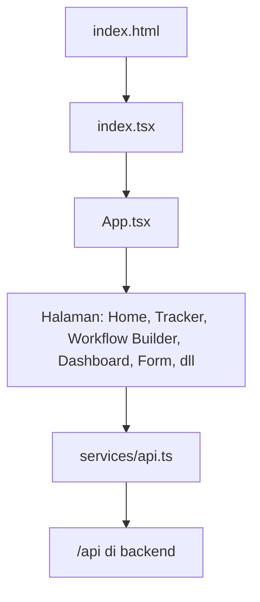
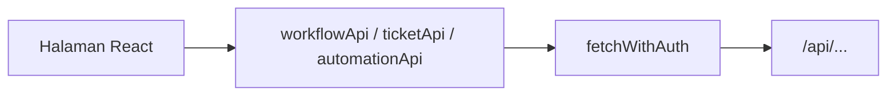

# Ringkasan Frontend

Frontend adalah aplikasi yang dibuka user di browser. Teknologinya React + Vite.

## Peran frontend

Frontend bertugas:

- menampilkan halaman dan navigasi;
- membaca token login dari `localStorage`;
- memanggil API backend melalui `services/api.ts`;
- menyimpan state sementara di browser;
- mendengarkan event realtime dari Socket.IO;
- mengubah tampilan sesuai data workflow, ticket, user, permission, dan setting.

## Titik masuk frontend

Alurnya:

`index.tsx` memasang React ke elemen `root`, mendaftarkan PWA service worker, lalu menjalankan `App`.

`App.tsx` adalah pusat besar aplikasi. Di sini sistem:

- menentukan user harus login atau boleh masuk public page;
- mengambil daftar workflow dari backend;
- mengambil user login dari `/api/auth/me`;
- menentukan halaman mana yang tampil berdasarkan URL dan query parameter;
- memasang provider global seperti socket, toast, theme, format tanggal, dan navigation;
- mendengar update realtime ticket, workflow, user, dan notification.

## Navigasi utama

Di `App.tsx`, halaman internal lebih banyak dikontrol lewat query parameter `view`.

Contoh:

- `view=home`: halaman home.
- `view=tracker&workflowId=...`: halaman workflow tracker.
- `view=create&workflowId=...`: form membuat ticket.
- `view=workflows`: workflow builder.
- `view=masters`: master data.
- `view=reports`: laporan.
- `view=automations`: dashboard automation.
- `view=custom-dashboards`: daftar dashboard custom.

Ada juga route publik:

- `/login`: login.
- `/auth/callback`: callback login Google.
- `/form/:slug`: public form.
- `/track/:token`: public ticket tracker.

## Cara frontend bicara dengan backend

Hampir semua request API lewat `services/api.ts`.

Di sana ada helper `fetchWithAuth` yang:

- otomatis menambahkan header `Authorization: Bearer <token>` kalau token ada;
- mengirim request ke base URL `/api`;
- kalau backend membalas `401`, user diarahkan ke `/login`, kecuali sedang di public form/tracker;
- menampilkan warning jika kena rate limit `429`.

Pola sederhananya:

## Folder frontend penting

- `components/`: komponen lama atau komponen umum lintas fitur.
- `src/features/tracker/`: halaman tracker dan semua view-nya.
- `src/features/workflowBuilder/`: builder workflow, field, status, permission, automation.
- `src/features/dashboard/`: dashboard standard, automation dashboard, custom dashboard.
- `src/features/publicPortal/`: public form dan public ticket tracker.
- `src/features/navigation/`: sidebar, mobile navigation, menu workflow.
- `contexts/`: state global seperti Socket, Theme, Toast.
- `services/`: pemanggilan API.
- `src/utils/` dan `utils/`: helper untuk format tanggal, field, branding, rule engine, formula, dan lain-lain.

