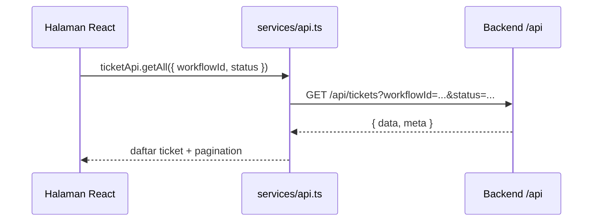

# services/api.ts - Jembatan Frontend ke Backend

File `services/api.ts` adalah kamus besar API frontend.

Bayangkan file ini seperti resepsionis frontend: halaman tidak langsung menulis URL API satu per satu, tapi memanggil fungsi yang lebih manusiawi seperti `ticketApi.getAll()` atau `workflowApi.update()`.

## Pola utama

1. Halaman memanggil fungsi API.
2. Fungsi API membangun endpoint, query, method, dan body.
3. `fetchWithAuth` menambahkan token login.
4. Backend menerima request di `/api/...`.
5. Response JSON dikembalikan ke halaman.

## Kelompok API utama

- `workflowApi`: membuat, membaca, update, hapus, archive, duplicate, rename field/status workflow.
- `ticketApi`: daftar ticket, detail ticket, create, update, delete, komentar, history, grouping, WIP limit, bulk action.
- `automationApi`: CRUD automation, log, retry, manual trigger.
- `dashboardApi`: statistik, trend, funnel, workload, pivot, KPI.
- `customDashboardApi`: dashboard custom.
- `publicFormApi`: membaca public form dan submit tanpa login.
- `userApi`, `roleApi`, `departmentApi`: manajemen user dan akses.
- `masterTableApi`: master data.
- `notificationApi`: unread count, notification per ticket, mark read/unread.
- `calculationRuleApi`: rule kalkulasi/formula.
- `documentTemplateApi`: template dokumen dan generate dokumen.
- `apiKeyApi`: API key external.
- `systemSettingApi`: logo, branding, hierarchy menu, typography, date-time format.

## Hal yang penting dipahami

Frontend tidak menyimpan data utama secara permanen. Data utama tetap ada di database backend. Frontend hanya:

- mengambil data;
- menampilkan data;
- mengirim perubahan;
- menyimpan token/user ringan di `localStorage`;
- menyimpan preferensi tampilan tertentu lewat API `userViewSettingApi`.

