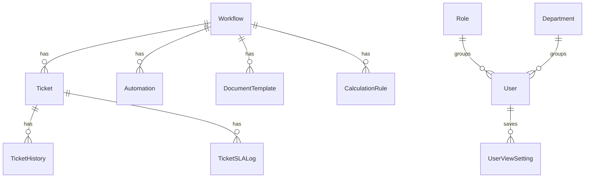

# Database dan Prisma

Database digambarkan di `server/prisma/schema.prisma`.

Backend menggunakan Prisma sebagai alat untuk bicara dengan PostgreSQL. Jadi route API tidak menulis SQL manual untuk kebanyakan kasus, tapi memanggil `prisma.ticket.findMany`, `prisma.workflow.update`, dan sejenisnya.

## Tabel inti

### Workflow

Workflow adalah definisi proses.

Isi penting:

- `name`, `description`: nama dan deskripsi proses.
- `statuses`: daftar status, misalnya Draft, In Progress, Done.
- `fields`: konfigurasi field dinamis form/tracker.
- `statusConfig`: aturan per status, permission, SLA, WIP, dan lain-lain.
- `statusTransitions`: status mana boleh pindah ke status mana.
- `workflowCanvas`: posisi node di canvas builder.
- `trackerConfig`, `cardViewConfig`, `timelineConfig`: konfigurasi tampilan tracker.
- `formAccess`, `trackerAccess`: permission form dan tracker.
- `resolvedStatuses`: status yang dianggap selesai.
- `publicFormConfig`: konfigurasi public form.

### Ticket

Ticket adalah data pekerjaan/record di dalam workflow.

Isi penting:

- `id`: ID internal.
- `shortId`: ID singkat yang terlihat manusia, memakai prefix workflow.
- `workflowId`: ticket ini milik workflow apa.
- `text`: judul/search utama.
- `status`, `priority`, `assignee`: field inti.
- `customData`: tempat field dinamis disimpan.
- `custom_text_1`, `custom_select_1`, dll: kolom optimasi untuk field tertentu.
- `parentTicketId`: relasi parent untuk grouping/hierarchy.
- `createdBy`, `createdAt`, `updatedAt`.
- `statusEnteredAt`, `slaDeadline`: dasar perhitungan SLA.
- `workflowFieldSnapshot`: snapshot field saat ticket dibuat.

### TicketHistory

Menyimpan riwayat ticket:

- ticket dibuat;
- status berubah;
- field berubah;
- komentar dibuat/diedit/dihapus;
- mention dan attachment komentar.

### Automation dan AutomationLog

Automation menyimpan aturan otomatisasi. AutomationLog menyimpan bukti eksekusi setiap automation.

Contoh trigger:

- ticket dibuat;
- status berubah;
- automation manual dari tombol.

### User, Role, Department

Dipakai untuk login, permission, assignment, dan akses status/tracker/form.

### MasterTable

Master data yang bisa dipakai oleh field select/cascading dropdown.

### UserViewSetting

Menyimpan preferensi tampilan user, misalnya pilihan view tracker, filter tracker, atau setting personal.

## Hubungan besar

