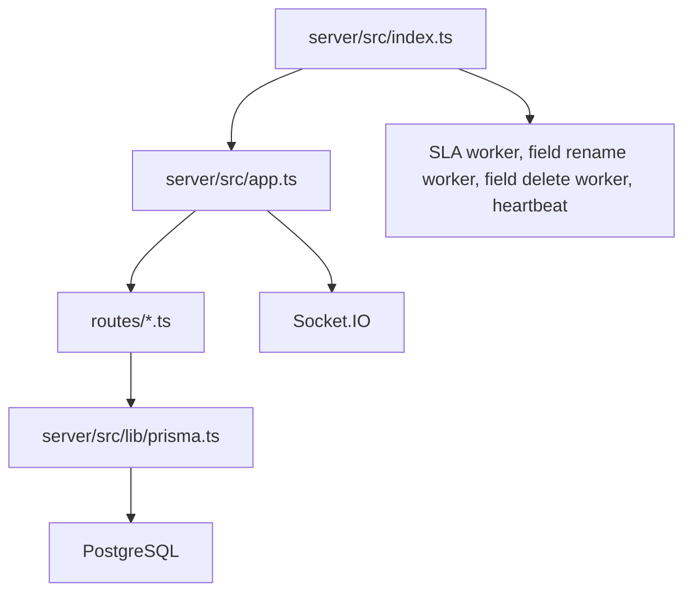

# Ringkasan Backend

Backend berada di folder `server/`. Teknologinya Express + Prisma + Socket.IO.

## Peran backend

Backend bertugas:

- menyediakan API `/api/...`;
- validasi request dari frontend dan external API;
- membaca/menulis database PostgreSQL via Prisma;
- menghitung SLA;
- menjalankan automation;
- membuat history ticket;
- mengirim notification;
- mengelola upload/storage;
- mengirim event realtime lewat Socket.IO;
- menjalankan worker background saat server menyala.

## Titik masuk backend

Ada dua file pusat:

- `server/src/app.ts`: membuat Express app, memasang middleware security, memasang semua route API.
- `server/src/index.ts`: menjalankan HTTP server, Socket.IO, dan background worker.

Alur sederhananya:

## Middleware besar di app.ts

Sebelum request sampai ke route API, backend memasang beberapa lapisan:

- `helmet`: security header.
- `cors`: mengizinkan frontend mengakses API.
- `rateLimit`: pembatas request, terutama saat production.
- `express.json` dan `express.urlencoded`: membaca body request JSON/form.
- health check `/api/health`.

Setelah itu route dipasang, misalnya:

- `/api/workflows` -> `routes/workflows.ts`
- `/api/tickets` -> `routes/tickets.ts`
- `/api/auth` -> `routes/auth.ts`
- `/api/automations` -> `routes/automations.ts`
- `/api/dashboard` -> `routes/dashboard.ts`
- `/api/public` -> `routes/publicRoutes.ts`
- `/api/public/tracker` -> `routes/publicTracker.ts`
- `/api/v2` -> API external versi baru.

## Worker background

Saat server menyala, `server/src/index.ts` menjalankan:

- `startSLAWorker()`: memproses status SLA.
- `startFieldRenameWorker()`: migrasi rename field secara aman.
- `startFieldDeleteWorker()`: cleanup ketika field dihapus.
- `HeartbeatService.start(io)`: heartbeat/realtime health.

Artinya backend tidak hanya merespons request. Ada pekerjaan latar belakang yang terus berjalan.

