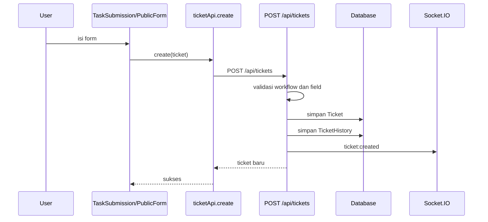

# Alur Create dan Update Ticket

Ticket bisa dibuat dari form internal, public form, external API, atau automation.

## Membuat ticket dari frontend internal

Alur sederhana:

## Apa yang backend lakukan saat membuat ticket

Di `server/src/routes/tickets.ts`, `POST /api/tickets` melakukan banyak hal:

1. Membaca `workflowId`, field inti, dan `customData`.
2. Memastikan workflow ada.
3. Mengabaikan field yang disabled.
4. Memisahkan field inti dari `customData`.
5. Menormalisasi user field ke email.
6. Validasi attachment.
7. Membuat `shortId` unik sesuai prefix workflow.
8. Menormalisasi field currency, relation, parent/grouping.
9. Menentukan judul/search utama di kolom `text`.
10. Mengecek required field berdasarkan konfigurasi form.
11. Menghitung SLA awal.
12. Menyimpan ticket ke database.
13. Menyimpan history `CREATED`.
14. Mengirim event realtime `ticket:created`.
15. Menjalankan automation `ticket_created` secara async.
16. Menghapus cache dashboard workflow.

## Update ticket

Saat ticket diubah:

1. Frontend memanggil `ticketApi.update(id, payload)`.
2. Backend menerima `PUT /api/tickets/:id`.
3. Backend mencari ticket lama.
4. Backend validasi perubahan, field, status transition, SLA, dan data dinamis.
5. Backend menyimpan perubahan.
6. Backend menulis history perubahan.
7. Backend mengirim event realtime `ticket:updated`.
8. Jika status berubah, automation status transition bisa berjalan.

## Kenapa backend banyak memproses data?

Karena workflow bersifat dinamis. Field bisa dibuat admin di Workflow Builder, sehingga backend tidak cukup menyimpan "kolom tetap". Backend perlu:

- membaca konfigurasi workflow;
- tahu field mana aktif/nonaktif;
- tahu field mana wajib;
- tahu field mana menjadi judul kartu;
- tahu status mana valid;
- tahu transition mana boleh;
- tahu field mana disimpan di kolom optimasi atau di `customData`.

