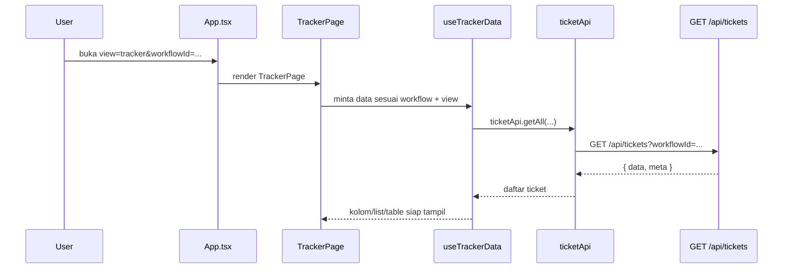
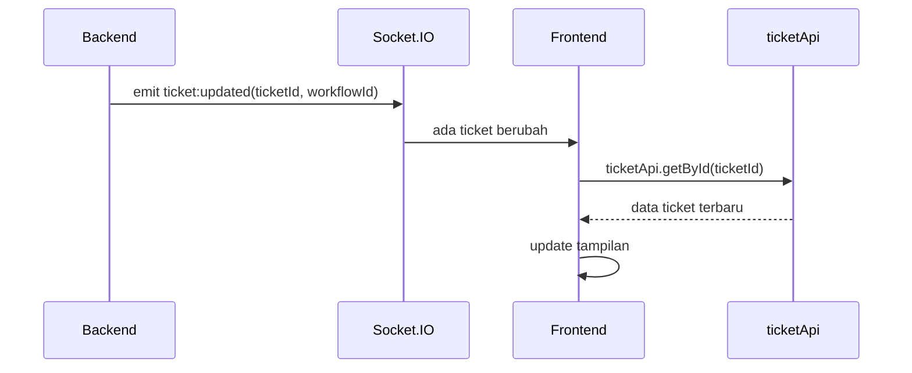

# Alur Halaman Workflow Tracker

Tracker adalah halaman untuk melihat dan mengelola ticket di dalam satu workflow.

File utama:

- `src/features/tracker/TrackerPage.tsx`
- `src/features/tracker/hooks/useTrackerData.ts`
- `src/features/tracker/hooks/useTrackerActions.ts`
- `services/api.ts`
- `server/src/routes/tickets.ts`
- `server/src/routes/workflows.ts`

## Saat user membuka tracker

1. User memilih workflow dari sidebar atau URL berisi `view=tracker&workflowId=...`.
2. `App.tsx` menampilkan `TrackerPage`.
3. `TrackerPage` mencari workflow aktif dari daftar workflow yang sudah dimuat.
4. Sistem mengecek apakah user boleh melihat tracker workflow itu.
5. Tracker menentukan mode tampilan: Kanban, List, Table, Gantt, atau Tree Table.
6. `useTrackerData` mengambil data ticket dari backend.

## Cara tracker mengambil data

`useTrackerData` membagi kebutuhan data menjadi dua pola:

- **Status-based**: untuk Kanban dan List. Data diambil per status/kolom.
- **Unified**: untuk Table/Gantt. Data diambil sebagai satu daftar besar dengan pagination/cursor.

Untuk Kanban/List, sistem mengambil ticket per status agar tiap kolom bisa punya pagination sendiri.

Untuk Table/Gantt, sistem mengambil daftar ticket gabungan karena bentuk tampilannya bukan kolom status.

## Search, filter, dan parent

Tracker mengirim parameter ke `/api/tickets`, misalnya:

- `workflowId`: workflow aktif.
- `status`: status tertentu untuk Kanban/List.
- `search`: kata pencarian.
- `filters`: advanced filter.
- `sort` dan `order`: urutan.
- `parentTicketId`: jika sedang melihat child ticket dari parent tertentu.
- `page`, `limit`, atau `cursor`: pagination.

Backend lalu menerjemahkan parameter itu menjadi query database.

## Realtime

Saat user membuka workflow, frontend bisa join room Socket.IO workflow tersebut.

Ketika backend membuat/update/delete ticket, backend mengirim event seperti:

- `ticket:created`
- `ticket:updated`
- `ticket:deleted`

Frontend mendengar event ini, lalu mengambil detail ticket terbaru lewat API. Jadi Socket.IO biasanya mengirim sinyal bahwa ada perubahan, sedangkan data lengkapnya tetap diambil lewat API.

## Perlindungan saat user sedang mengetik

Tracker punya konsep "zero rollback protection".

Artinya: kalau user sedang mengedit field, lalu ada update realtime dari server, sistem berusaha tidak langsung menimpa nilai yang sedang diketik user. Ada jeda perlindungan sekitar beberapa detik dan merge khusus untuk field yang sedang fokus.

Tujuannya supaya pengalaman user tidak terasa seperti input tiba-tiba kembali ke nilai lama.

