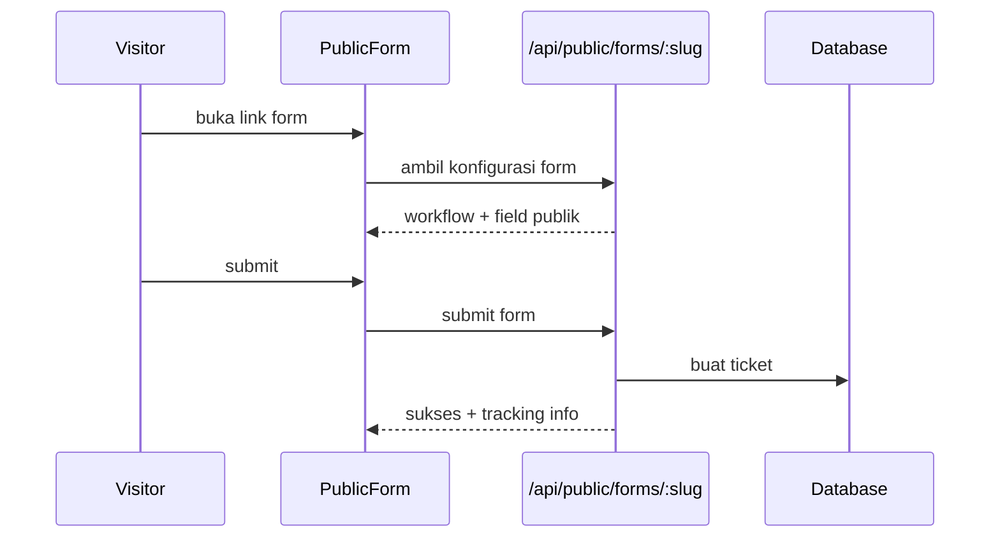

# Alur Public Form dan Public Tracker

Ada dua halaman publik utama:

- `/form/:slug`: form publik untuk submit ticket.
- `/track/:token`: halaman publik untuk melacak ticket.

Halaman ini berbeda dari halaman internal karena tidak selalu butuh login.

## Public Form

File frontend:

- `src/features/publicPortal/components/PublicForm.tsx`

API frontend:

- `publicFormApi.getBySlug(slug)`
- `publicFormApi.submit(slug, data)`
- `publicFormApi.getOptions(slug, fieldId, query)`

Backend:

- `GET /api/public/forms/:slug`
- `POST /api/public/forms/:slug/submit`
- `GET /api/public/forms/:slug/options/:fieldId`

Alur:

## Public Tracker

File frontend:

- `src/features/publicPortal/components/PublicTicketTracker.tsx`

Backend:

- `GET /api/public/tracker/track/:token`

Public tracker memakai `trackingToken` pada ticket, bukan token login user.

Tujuannya supaya orang luar bisa melihat status ticket tertentu tanpa akses ke seluruh aplikasi internal.

