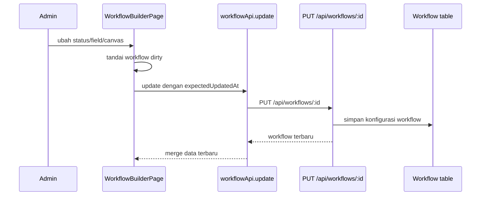

# Alur Workflow Builder

Workflow Builder adalah tempat admin membuat dan mengatur workflow.

File utama:

- `src/features/workflowBuilder/WorkflowBuilderPage.tsx`
- `src/features/workflowBuilder/components/...`
- `services/api.ts` bagian `workflowApi` dan `automationApi`
- `server/src/routes/workflows.ts`
- `server/src/routes/automations.ts`

## Apa yang bisa diatur di Workflow Builder

Workflow Builder mengatur:

- nama dan deskripsi workflow;
- daftar status;
- canvas/status node;
- aturan transisi antar status;
- field form/tracker;
- field yang menjadi judul kartu;
- permission form dan tracker;
- permission edit/view per status;
- card view;
- tracker view setting;
- SLA per status;
- WIP limit;
- working hours;
- hierarchy menu;
- automation;
- upload/import data ticket;
- API info dan MCP info.

## Pola penyimpanan

Workflow Builder memakai local state dulu, lalu menyimpan ke backend.

Ada beberapa pola:

- perubahan canvas disimpan dengan debounce sekitar 1 detik;
- beberapa perubahan modal disimpan saat user klik save;
- workflow membawa `expectedUpdatedAt` untuk mencegah konflik jika admin lain sudah mengubah workflow yang sama.

## Kenapa Workflow penting untuk tracker?

Tracker bukan halaman statis. Tracker berubah sesuai konfigurasi workflow.

Workflow menentukan:

- kolom status yang muncul di Kanban/List;
- field mana muncul di kartu;
- field mana bisa diedit;
- status mana boleh dilihat user;
- status mana dianggap selesai;
- tampilan default tracker;
- apakah workflow punya grouping parent;
- field mana jadi timeline untuk Gantt;
- apakah ada SLA atau WIP limit.

